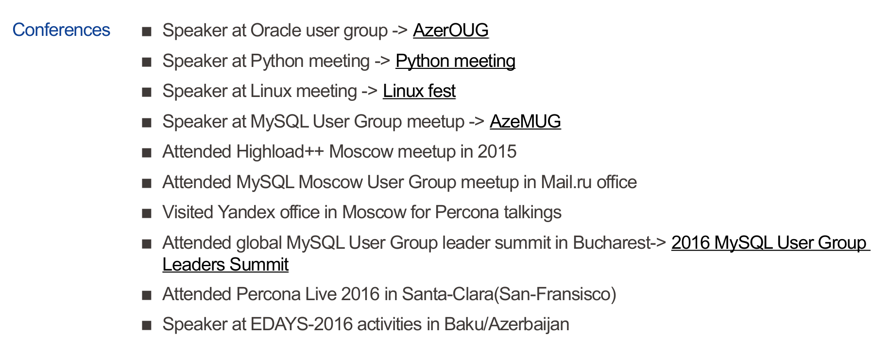

# Kitaba tələbat haqqında
Əziz oxucu, `Data strukturları və Alqoritmlər` mövzusu, hər bir proqramçının hər şeydən öncə qavramalı, üzərində ciddi düşünməli olduğu mövzudur. Bu mövzuda, öz dilimizdə mənbə azlığı qənaətinə gəldim və bu işi görməyə qərara verdim.

# Nəyə görə Python?
Son illərdə bu dilin reytinqlərdə birinci yerdə durması, çox geniş istifadəçi kütləsinin olması, Open Source, öyrənilməsi asan, çox geniş kitabxanalara sahib olması və s. kitabdakı nümunələrin Python-da olması fikrimi qətiləşdirdi.
Python-a vaxt və sərmayə ayırmaq məsləhətdir. Belə ki, bu dil, günümüzün yeni peşələrinə daha tez uyğunlaşmanıza yardımçı olacaq.

# Müəllif haqqında
Kitabı Github-da Azerbaijan Python User Group adı altında yazmağıma səbəb budur ki, bu kitab, Open Source, hər tənqidə açıq, havayı və yayıla bilən olmalıdır. Dolayısı ilə, ilkin məqsəd kitaba Azərbaycandan hər kəsin əlavə və dəyişikliklər göndərməsi yönündədir.
Lakin, əsas inisiativ, [AzePUG](https://www.facebook.com/groups/python.az/) və [AzeMUG](https://www.facebook.com/groups/mysql.azerbaijan/) qrup lideri [Şəhriyar Rzayevə](https://www.facebook.com/hadjirza.s) məxsusdur.

Müəllifin bəzi nəaliyyətləri haqqında:

**Hazırkı vəzifəsi:**
Percona LLC-də QA Engineer

**Sertifikat və nəaliyyətlər:**

Red Hat Certified System Administrator - [RHCSA](https://www.redhat.com/rhtapps/certification/badge/verify/RS4ZT3YPLAFRBTBNKH2BOJAXJAAEQU3CUPSQX2KSDXT6RW46LQ37ULE25V3KCXMMFRIX6PMBNQZGA4U5NQYTCNA62RUWOCM34WWBUYQ%3D/)

OCP MySQL 5.0 Database Administrator - [OCP](http://rzayevsehriyar.files.wordpress.com/2012/02/20130306_235027.jpg)

Oracle ACE Associate award - [MySQL ACE](https://apex.oracle.com/pls/apex/f?p=19297:4:::NO:4:P4_ID:15420)

MySQL 5.7 Community Contributor Award Program 2015(see my name first) -> [MySQL CCAP](https://blogs.oracle.com/mysql/mysql-57-community-contributor-award-program-2015)

**Community fəaliyyətlərindən:**

Texniki rəsmi blog - [mysql.az](https://mysql.az/)

Azərbaycanın expertlər topluluğunun aktiv üzvü - [technet.az](http://www.technet.az/user/shahriyar/)

Qatıldığı konfranslar-

**Open Source fəaliyyətlərindən:**

MySQL-AutoXtrabackup commandline tool - [autoxtrabackup](https://github.com/ShahriyarR/MySQL-AutoXtraBackup)

MySQL-ə report etdiyi BUG-lar - [MySQL bugs](https://bugs.mysql.com/search.php?cmd=display&status=all&mine=0&reporter=6786791&begin=120)

# Kitab kimlər üçün nəzərdə tutulub?
İlk öncə, onu vurğulamaq lazımdır ki, bu kitab Python dilinin özünü öyrətmir. Yəni, proqramlaşdırma dili kitabı deyildir. Kitabdakı alqoritmik məsələləri həll etmək üçün yazılan kod nümunələri Python-dadır. Dolayısı ilə, bu kitab üçün sizin Python dili biliyiniz olmalıdır.

# Hansı Python?
Kitabdakı kod nümunələri Ubuntu 17.04 əməliyyat sistemində Python-un 3.5 versiyasında test edilib, yerləşdirilib. Lakin, verilmiş nümunələr Python 3.5 olan istənilən əməliyyat sistemində işləməlidir.

# Kitaba kömək və səhvlərin aşkarlanması
Qeyd edək ki, müəllif Azərbaycan dili qrammatikasına bacardığı qədər riayət etməyə çalışır, lakin sözsüz qrammatik səhvlər olur və olmalıdır. 
# Kitabda aşkarlanmış qrammatik və məntiqi səhvləri necə bildirmək olar?
Yuxarıda da qeyd etdiyimiz kimi, kitab Open Source proyekt kimi Github-da yerləşdirilmişdir -
[Kitab üçün repo](https://github.com/AzePUG/Data_Structures_Algo_Python)

Aşkarlanan səhvləri, githubda issue kimi bildirə bilərsiniz. Digər bir faydalı iş o olardı ki, aşkarladığınız səhvləri düzəldib proyektimizə Pull Request göndərəsiniz. Bu minvalla kitab öz mükəmməlliyinə çatar.
