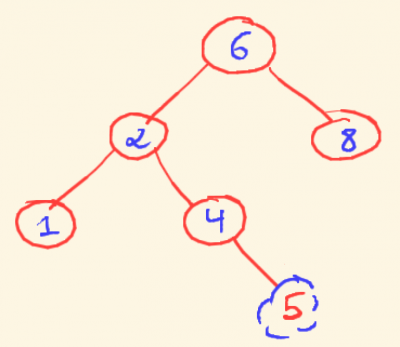

# Binary Search Trees (İkili Axtarış Ağacları)

## Nəyə görə BST-lər?

Əvvəlki fəsillərdə bir neçə ağac növündən bəhs etdik və onların heç birində node-da saxlanılan məlumatlar üçün məhdudiyyət yox idi. Nəticə etibari ilə, ağacda element axtaranda həm sol altağacı, həm də sağ altağacı yoxlayırdıq ki, bu da ən pis halda `O(n)` vaxt mürəkkəbliyi verirdi.

Bu fəsildə ikili ağacın digər variantına baxacıq: İkili Axtarış Ağacları(BSTs). Adından da göründüyü kimi, bu ağac məhz axtarış üçündür. Artıq BST-də biz node-larda saxlanılan data(məlumat)-ya müəyyən tələblər qoyuruq ki, nə saxlanıla bilər nə yox. Bunun nəticəsində biz ən pis halda `O(logn)` mürəkkəblik əldə etmiş oluruq.

## İkili Axtarış Ağacının xüsüsiyyəti

BST-lər üçün bir şeyi yadda saxlamaq lazımdır ki, bütün sol altağacın elementləri root-dan kiçik, bütün sağ altağacın elementləri isə root-dan böyük olmalıdır. Onu da qeyd edim ki, bu tələb bütün node-lar tərəfindən ödənilir. Yəni həm sol, həmdə sağ altağacların özləri də BST olmalıdırlar.

## BST declaration - BST elan olunması, təyin edilməsi.

Adi ikili ağacın və ikili axtarış ağacının elan olunması(deklarasiyası) arasında heç bir fərq yoxdur. Fərqlilik, yalnız saxlanılan məlumatdadır(data), struktur eynidir. Lakin, hər ehtimala qarşı, biz tipin(class) adını BSTNode olaraq qeyd edək:
> Bütün kodlara buradan baxa bilərsiniz: [fesil11_binary_search_tree.py](../Source_Code/python_kodlar/fesil11/fesil11_binary_search_tree.py)

```python
class BSTNode:
    def __init__(self, data):
        # root node
        self.data = data
        # Sol övlad(left child)
        self.left = None
        # Sağ övlad(right child)
        self.right = None

    def get_data(self):
        return self.data

    def get_left_child(self):
        return self.left

    def get_right_child(self):
        return self.right
```

## BST-lər üzərində əməliyyatlar

**Əsas əməliyyatlar**

* İkili axtarış ağacında minimum, maximum və axtarılan elementin tapılması.
* BST-yə element daxil etmək.
* BST-dən element silmək.

**Əlavə əməliyyatlar**

* Verilmiş ağacın BST olub olmamasını yoxlamaq.
* BST-nin elementlərini sıralamaq və s.


## BST-lər üçün vacib qeydlərə nəzər salaq

* Root node, hər zaman sol altağac data-sı və sağ altağac data-sı arasında yerləşdiyi üçün, BST üzərində inorder traversal sıralanmış list qaytarır.
* Təsəvvür edin ki, biz hər hansı elementi BST-də axtarırıq və sol altağac root node, bizim axtardığımız elementdən kiçikdirsə, o zaman sol tərəfə getməyin bir mənası qalmır. Burdan belə bir nəticə çıxır ki, biz ikili axtarış ağacında, ya sol, ya da sağ altağacda axtarış aparırıq. Heç vaxt hər iki tərəfdə axtarmırıq. Məhz bu səbəbdən BST-də axtarış sürətlidir.

## BST-də element axtarmaq

BST-də axtarış, kifayət qədər sadə və aydın əməliyyatdır. Root node-la başlayırıq, sola və ya sağa doğru gedirik.
Əgər axtardığımız element, node-un datasından kiçikdirsə sol altağacda axtarırıq, əksinə böyükdürs, sağ tərəfdə axtarırıq.
Əgər axtarılan məlumat tapılmadısa, o zaman NULL(None) qaytarırıq. Bu məqsədlə yazmış olduğumuz sadə koda baxaq:

```python
def find_element(self, root, data):
      # Axtarışa root-dan başlayırıq.
      current_node = root
      while current_node is not None and data != current_node.get_data():
          # Yoxlayırıq ki, axtardığımız element hal-hazırkı node data-sından böyükdür ya yox.
          # Əgər böyükdürsə, o zaman sağ altağaca keçirik.
          if data > current_node.get_data():
              current_node = current_node.get_right_child()
          # Əgər kiçikdirsə, o zaman sol altağaca keçirik.
          else:
              current_node = current_node.get_left_child()
      return current_node
```

İnteraktiv Python mode-dan istifadə edərək, kodumuzu test edək. İlk öncə, kod olan qovluğa keçirik `Data_Structures_Algo_Python/Source_Code/python_kodlar/fesil11`. Daha sonra:

```python
$ python3
Python 3.6.6 (default, Sep 12 2018, 18:26:19)
[GCC 8.0.1 20180414 (experimental) [trunk revision 259383]] on linux
Type "help", "copyright", "credits" or "license" for more information.

>>> import fesil11_binary_search_tree
>>> tree = fesil11_binary_search_tree.BSTree()
>>> arr = [8, 3, 1, 6, 4, 7, 10, 14, 13]
>>> for i in arr:
...     tree.create_tree(i)
...

>>> print(tree.find_element(tree.root, 11))
None

>>> print(tree.find_element(tree.root, 10))
<fesil11_binary_search_tree.BSTNode object at 0x7f110cd2b2b0>
```

11 bizim ağacda yoxdur, bu səbəbdən None qaytardıq, 10 isə var və müvafiq obyekti return etmişik.

## BST-də minimum elementi tapmaq:

Sol child-ı olmayan ən sol node özündə ağacın ən kiçik, minimum elementini saxlayır.
Yəni ikili axtarış ağacında, minimal data-lı node, sol altağacda yerləşir və həmin node-un sol node-u yoxdur.


Aşağıdakı kod, rekursiv üsulla yazılıb:

```python
  # Rekursiv üsul    
  def find_min_element(self, root):
      current_node = root
      if current_node.get_left_child() == None:
          return current_node
      else:
          return find_min_element(current_node.get_left_child())
```
Vaxt mürəkkəbliyi: Ən pis halda `O(n)`
Yer mürəkkəbliyi: `O(n)` rekursiv stack yarandığı üçün.

Bu kodu bir də rekursiv olmayan üsulla yazmağa çalışaq:

```python
  # Rekursiv olmayan üsul
  def find_min_element_non_recursive(self, root):
      current_node = root
      if current_node is None:
          return None
      while current_node.get_left_child() is not None:
          current_node = current_node.get_left_child()
      return current_node
```

Vaxt mürəkkəbliyi: `O(n)`
Yer mürəkkəbliyi: `O(1)`

Kodumuzu bu dəfə python faylı run edərək test edək:

```python
$ python3 fesil11_binary_search_tree.py
Mövcud elementi axtarmaq ->  <__main__.BSTNode object at 0x7f8a50f7df28>
Mövcud olmayan elementi axtarmaq ->  None
Minimal elementi axtarmaq rekursiya ->  1
Minimal elementi axtarmaq rekursiv olmayan ->  1
```

## BST-də maximum elementi tapmaq

Minimum elementi biz sol altağacda axtarırdıqsa, maximum elementi biz təbii ki, sağ altağacda axtaracıq.
Maximum element sağ node-u olmayan, ən sağdakı node-da saxlanılır.


Rekursiv üsulla biz kodu belə yaza bilərik:

```python
  # Rekursiv üsul
  def find_max_element(self, root):
      current_node = root
      if current_node.get_right_child() == None:
          return current_node
      else:
          return self.find_max_element(current_node.get_right_child())
```
Vaxt mürəkkəbliyi: Ən pis halda `O(n)`
Yer mürəkkəbliyi: `O(n)` rekursiv stack yarandığı üçün.

Başqa cür də belə yaza bilərik:

```python
  # Rekursiv olmayan üsul
  def find_max_element_non_recursive(self, root):
      current_node = root
      if current_node is None:
          return None
      while current_node.get_right_child() is not None:
          current_node = current_node.get_right_child()
      return current_node
```

Vaxt mürəkkəbliyi: `O(n)`
Yer mürəkkəbliyi: `O(1)`

Kodumuzu test edirik:

```python
$ python3 fesil11_binary_search_tree.py
Mövcud elementi axtarmaq ->  <__main__.BSTNode object at 0x7f831e8a5fd0>
Mövcud olmayan elementi axtarmaq ->  None
Minimal elementi axtarmaq rekursiya ->  1
Minimal elementi axtarmaq rekursiv olmayan ->  1
Maximal elementi axtarmaq rekursiv ->  14
Maximal elementi axtarmaq rekursiv olmayan ->  14
```

## Inorder Predecessor and Successor

Bunu birbaşa tərcümə etdikdə, simmetrik xələf və sələfin tapılması kimi edə bilərik. Lakin, ondansa elə inorder predcessor və successor deyək.
İkili axtarış ağacındakı X node-un 2 child-ı varsa, onun inorder predecessor-u sol altağacdakı maximum elementdir(yəni ən sağ node-da qalan), inorder successor isə sağ altağacdakı minimum elementdir(yəni ən sol node-da qalan):


Kod nümunələrinə baxaq:

```python
def predecessor_bst(self, root):
      temp = None
      if root.get_left_child():
          temp = root.get_left_child()
          while temp.get_right_child():
              temp = temp.get_right_child()
      return temp


  def successor_bst(self, root):
      temp = None
      if root.get_right_child():
          temp = root.get_right_child()
          while temp.get_left_child():
              temp = temp.get_left_child()
      return temp
```

Nəticələrə baxaq:

```python
$ python3 fesil11_binary_search_tree.py
Mövcud elementi axtarmaq ->  <__main__.BSTNode object at 0x7fb58514e160>
Mövcud olmayan elementi axtarmaq ->  None
Minimal elementi axtarmaq rekursiya ->  1
Minimal elementi axtarmaq rekursiv olmayan ->  1
Maximal elementi axtarmaq rekursiv ->  14
Maximal elementi axtarmaq rekursiv olmayan ->  14
Inorder Predecessor ->  7
Inorder Successor ->  10
```

## İkili ağaca element daxil etmək

BST-yə data əlavə etmək üçün, ilk öncə onu hara daxil edəcəyimizi tapmalıyıq. Biz daxil edəcəyimiz yeri, `find_element` funksiyasını yazarkən istifadə etdiyimiz məntiqlə tapırıq. Daxil edəcəyimiz yeri axtararkən, əgər data artıq ağacda varsa, sadəcə onu görməzdən gəlirik(ignore) və ağacı olduğu kimi geri qaytarırıq(return).

Məsələn aşağıdakı BST-yə 5 elementini daxil etmək istədikdə, ilk öncə yoxlamalıyıq ki, bu element root node-dan(6) böyükdür, ya kiçik.
Kiçik olduğu üçün sol altağaca düşürük. Sol altağacda 2 node-u üçün də eyni şeyi yoxlayırıq, 5 2-dən böyük olduğu üçün bu dəfə sağ altağaca düşürük. Burada görürük ki, 5 4-dən böyükdür və 4-un sağ altağacı yoxdur dolayısı ilə 5 üçün ən ideal yer elə buradır:



Bu məqsədlə kodumuzu yazaq:

```python
def insert_node(self, root, node_data):
      if root is None:
          root = BSTNode(data=node_data)
      else:
          if node_data < root.get_data():
              if root.get_left_child() is None:
                  root.left = BSTNode(data=node_data)
              else:
                  self.insert_node(root.get_left_child(), node_data)
          else:
              if root.get_right_child() is None:
                  root.right = BSTNode(data=node_data)
              else:
                  self.insert_node(root.get_right_child(), node_data)
      return node_data
```

```python
$ python3 fesil11_binary_search_tree.py
Mövcud elementi axtarmaq ->  <__main__.BSTNode object at 0x7fcb2f6cb1d0>
Mövcud olmayan elementi axtarmaq ->  None
Minimal elementi axtarmaq rekursiya ->  1
Minimal elementi axtarmaq rekursiv olmayan ->  1
Maximal elementi axtarmaq rekursiv ->  14
Maximal elementi axtarmaq rekursiv olmayan ->  14
Inorder Predecessor ->  7
Inorder Successor ->  10
BST-yə element daxil edirik ->  25
Maximal elementi axtarmaq rekursiv ->  25
```

## BST-dən element silmək

İkili axtarış ağacından element silmək, digər əməliyyatlara nəzərən mürəkkəbdir. Məsələnin, çətin tərəfi ondan ibarətdir ki, sildiyimiz node leaf node olmaya bilər. Yəni ondan sonra da node-lar ola bilər. Elementi silmək üçün, təbii ki, yuxarıda olduğu kimi həmin elementi axtarıb tapmaq lazımdır.
