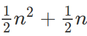
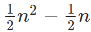

# Sıralama(sorting)

## Sıralama nədir?
Sıralama verilmiş elementləri müəyyən qanunauyğunluğa əsasən(azalan və ya çoxalan) düzən(sahmana salan) alqoritmdir.

## Sıralama nəyə görə vacibdir?
Sıralama, kompüter elmlərində vacib bölmələrdən birini təşkil edir. Bu sahədə bir çox araşdırmalar aparılıb.
Sıralama, bir çox hallarda, verilmiş problemin mürəkkəbliyini azalda bilir. Məlumat bazası(database) alqoritmləri və axtarışlar üçün geniş istifadə olunur.

# Sıralama alqoritmlərinin sinifləndirilməsi
Aşağıdakı parametrlərə əsasən biz, sıralama alqoritmlərini sinifləndirə bilirik.

## Müqayisə sayına görə
Bu üsul zamanı, sıralama alqoritmləri müqayisələrin sayına əsasən sinifləndirilir. Müqayisə əsaslı sıralama alqoritmləri üçün ən yaxşı hal - `O(nlogn)` ən pis hal isə `O(n^2)` hesab olunur. Müqayisə əsaslı(comparison-based) sıralama alqoritmləri listin elementlərini müqayisə etməklə emal edirlər.

Bu mövzumuzda müqayisəli olmayan(non-comparison və ya linear) sıralama alqoritmlərindən də bəhs edəcəyik. Misal olaraq, Counting sort, Bucket sort və Redix sort göstərə bilərik.

## Yerdəyişmə sayına görə
Bu zaman, sıralama alqoritmləri edilən yerdəyişmələrin sayına əsasən kateqoriyalaşdırılır. Buna bəzən inversiyalar da deyilir(swaps, inversions).

## Yaddaş istifadəsinə görə
Bəzi sıralama alqoritmləri "yerində" (in-place) sayılır və müvəqqəti sıralama üçün `O(1)` və ya `O(logn)` yaddaş tələb edirlər.

## Rekursiyaya görə
Sıralama alqoritmləri ya rekursiv(quick sort) ya da rekursiv olmayan(non-recursive) üsuldan istifadə edə bilərlər və ya hər ikisindən(merge sort).

# Bubble sort
Ən sadə sıralama alqoritmi Bubble sort-dur. Elementləri birincidən axırıncıya qədər gəzir, hər bir cütü müqayisə edir və lazım olduqda, yerdəyişmə edir. Bubble sort, yerdəyişməyə ehtiyac qalmayana qədər öz iterasiyasına(irəliləyişinə) davam edir.

Gəlin bu sıralama alqoritminin koduna baxaq:
Mənbə: [InteractivePython](http://interactivepython.org/runestone/static/pythonds/SortSearch/TheBubbleSort.html)

```python
def bubbleSort(alist):
    for passnum in range(len(alist)-1,0,-1):
        for i in range(passnum):
            if alist[i]>alist[i+1]:
                temp = alist[i]
                alist[i] = alist[i+1]
                alist[i+1] = temp
```

Elə təsəvvür edək ki, `n` elementli bir listimiz var, bu zaman üzərindən keçib müqayisə aparmalı olduğumuz `n - 1` qədər cütümüz var. Birinci iterasiyadan(qarşılıqlı müqayisələrdən) sonra ən böyük ədəd ən sona yerləşir. Bundan sonra bizdə `n - 1` elementli list qalır ki, bu zaman da `n - 2` qədər cütləri müqayisə etmək lazımdır. Bu proses son iki element müqayisə olunduqdan sonra(müqayisə olunmalı listdə 2 element qalır, 1 cüt) bitir. Birinci addımda(əvvəldən axıra kimi, cütlərin müqayisəsi nəzərdə tutulur) müqayisə olunası cütlərin sayı `n - 1`-dir, ikinci addımda `n - 2`-dir, üçüncü addımda `n - 3`-dür və ən axırıncı addımda, müqayisə olunan cütlərin sayı 1-dir. Bu da bizə `1 .. n - 1` sayda elementdə ibarət olan ədədi silsiləni verir.
Yadımızdadır ki, ilk n elementin cəmi düsturu:


Bizə isə ilk `n - 1` elementin cəmi lazım olduğu üçün, düsturda n-i, n - 1-lə əvəzləmək lazımdır:


Bu düstura əsasən alqoritmin mürəkkəbliyinin, `O(n^2)` olduğu aşkarlanır.
