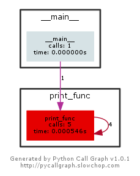

# Rekursiya və Backtracking

> Hal-hazırda backtracking sözünə öz dilimizdə tam uyğun tərcümə tapa bilmədim.
> Aşağıdakılar rus və türk dillərindən götürülüb:
> sarfınazar etmək, vazgeçmek, sözünden dönmek, aynı yoldan geri dönmek.
> отход, отступление, отступать

## 2.1 Giriş
Bu fəsildə, ən vacib məsələlərdən olan, *rekursiya* və onunla əlaqəli *backtracking* mövzularına toxunacıq.

## 2.2 Rekursiya nədir?
Öz-özünü çağıran istənilən funksiya *rekursiv* funksiya adlanır. Problemin rekursiv həlli dedikdə, o başa düşülür ki, problem hər dəfə daha kiçik problemlə işləmək üçün özünün surətini(kopyasını) çağırır. Bu kimi, rekursiv addımlar, digər rekursiv çağırışlarla nəticələnə bilər.

Yəni, hər funksiya müəyyən problem üçün özü özünü bir neçə və yaxud sonsuz sayda çağıra bilər. Bu isə bizi vada edir ki, rekursiv əməliyyatları(rekursiya) müəyyən şərtlər altında mütləq sonlandıraq, tamamlandıraq. Digər sözlə, rekursiya sonlu olmalıdır.

Daha sadə, izah etməli olsaq, rekursiya, bir problemin, daha kiçik, xırda hissələrlə, öz-özünü çağırması ardıcıllığıdır. Bir şeyi yadda saxlamaq lazımdır ki, bu ardıcıllıqlar, son nəticədə əsəs problemə əsaslanmalıdırlar.

## 2.3 Nəyə görə rekursiya?
Rekursiya riyaziyyatdan götürülmüş faydalı bir üsuldur(metoddur). Rekursiv üsulla yazılmış kod, ümumən iterativ üsulla yazılan koddan daha qısa, kodu yazmaq daha sadə olur.

Rekursiya, bir-birinin oxşarı olan alt tapşırıqlar kimi göstərilə bilən daha böyük tapşırıqların həllində daha faydalı olur. Məsələn, sıralama, axtarış, kəsişmə problemlərinin, adətən, sadə rekursiv həlləri mövcuddur.

## 2.3 Rekursiv funksiyanın formatı haqqında
Rekursiv funksiya, bir tapşırığı icra etmək üçün, öz-özünü çağırmaqla alt tappşırıqları(subtasks) həll edir. Bir neçə icradan sonra, elə vəziyyət gəlir ki, alt tapşırıq daha öz-özünü çağırmadan icra olunur. Bu hala, əsas hal(base case) deyilir, harda ki, funksiya artıq rekursiv olmur(does not recur). Bundan öncəki, alt tapşırığı həll etmək üçün, funksiyanın öz-özünü çağırması hallarına isə kursiv hal deyilir(cursive case).

Rekursiv funksiyaya misal olaraq, faktorialın hesablanmasını göstərə bilərik. n! faktorial 1-dən n-ə qədər olan bütün ədədlərin hasilidir. Faktorialın açıqlaması:

```
n! = 1, əgər n = 0
n! = n * (n - 1)!, əgər n > 0
```
Bu tərif(açıqlama) çox asanlıqla, rekursiv üsulla göstərilə də bilər. Daha sadə desək, tapşırığın özü n!-dir, lakin bir də bunun alt tapşırığı var (n - 1)!.
Rekursiv hal üçün, n-nin 1-dən böyük hallarında,(n - 1)!-in dəyərini aşkarlamaq üçün funksiya öz-özünü çağırır və həmin qiyməti n-ə vurur.

Bu funksiyanın əsas halı(base case) n 0 və ya 1 olanda qeydə alınır. Bu zaman heç bir rekursiv çağırışa ehtiyac olmadan 1 qaytarılır.

Rekursiv üsulla faktorial hesablayan kod:

```
def factorial(n):
    if n == 0 or n == 1:
        return 1

    return n * factorial(n - 1)

print(factorial(10))
```

## 2.4 Rekursiya və yaddaş vizualizasiyası haqqında.
Bir şeyi qeyd etməliyik ki, hər rekursiv çağırış, yaddaşda həmin funksiyanın kopyasını saxlayır. Funksiya bitdikdən sonra(hər hansı məlumatı return etdikdə), məlumatı geri qaytaran həmin funksiya yaddaşdan silinir. Rekursiv kod çox sadə görsənir, əslində isə, vizualizasiya və kodu icrasını izləmək(tracing) çətinləşir.


```
def print_func(n):
    if n == 0: # funksiyanı bitirən əsas hal.
        return 0
    else:
        print(n)
        return print_func(n - 1) # rekursiv çağırış

print(print_func(4))
```

**Sual:** Yuxarıdakı `print_func()` funksiyası toplam neçə dəfə çağırılacaq.
**Cavab:** Toplamda 5 dəfə. 1 dəfə `print()` daxilində, 4 dəfə də rekursiv şəkildə

Aşağıdakı şəkilə diqqət yetirsək bunu aydın görərik. Sağ tərəfdəki ox öz-özünü 4 dəfə çağırmağa işarədir:



> Bu şəkli hazırlayan kod: [fesil2_2.5_pycallgraph.py](../Source_Code/fesil2/fesil2_2.5_pycallgraph.py)

Digər tərəfdən, biz yuxarıda dedik ki, hər bir rekursiv çağırış yaddaşda saxlanılır. Yəni biz bu çağırışları istədiyimiz anda `stack frame`-də görə bilərik.
Bunu göstərmək üçün mən interaktiv debugger olan pdb-dən istifadə etmək istəyirəm. Pdb haqqında daha ətraflı oxuya bilərsiniz: [pdb doc](https://docs.python.org/3.5/library/pdb.html)


> pdb ilə kod nümunəsi: [fesil2_2.5_pdb.py](../Source_Code/fesil2/fesil2_2.5_pdb.py)

```
$ python fesil2_2.5_pdb.py
> /home/shako/REPOS/Data_Structures_Algo_Python/Source_Code/fesil2_2.5_pdb.py(14)<module>()
-> print_func(4)
(Pdb) c
4
3
2
1
> /home/shako/REPOS/Data_Structures_Algo_Python/Source_Code/fesil2_2.5_pdb.py(6)print_func()
-> return 0
```

Bundan sonra, biz interaktiv debuggerin daxilində `where` əmrini yazsaq o bizə, ən yeni frame ən aşağıda olmaqla, `stack trace` çıxardacaq:

```
(Pdb) where
  /home/shako/REPOS/Data_Structures_Algo_Python/Source_Code/fesil2_2.5_pdb.py(14)<module>()
-> print_func(4)
  /home/shako/REPOS/Data_Structures_Algo_Python/Source_Code/fesil2_2.5_pdb.py(9)print_func()
-> return print_func(n - 1) # rekursiv çağırış
  /home/shako/REPOS/Data_Structures_Algo_Python/Source_Code/fesil2_2.5_pdb.py(9)print_func()
-> return print_func(n - 1) # rekursiv çağırış
  /home/shako/REPOS/Data_Structures_Algo_Python/Source_Code/fesil2_2.5_pdb.py(9)print_func()
-> return print_func(n - 1) # rekursiv çağırış
  /home/shako/REPOS/Data_Structures_Algo_Python/Source_Code/fesil2_2.5_pdb.py(9)print_func()
-> return print_func(n - 1) # rekursiv çağırış
> /home/shako/REPOS/Data_Structures_Algo_Python/Source_Code/fesil2_2.5_pdb.py(6)print_func()
-> return 0
```

Diqqət etsəniz, yuxarıda dediyimizin sübutu olaraq 4 rekursiv çağırışın hər birinin kopyasının var olduğunu görürük.

Bəs bizim faktorial kodumuz? Onu da debugger ilə çalışdırıb, icra edib, rekursiv çağırışlara və həmçinin `frame`-də yuxarı doğru(up komandası ilə) getməklə verilmiş `n` rəqəminin həmin an üçün dəyərinə baxa bilərik.

> Factorial + debugger kodumuz: [fesil2_2.5_factorial_pdb.py](../Source_Code/fesil2/fesil2_2.5_factorial_pdb.py)

Debugger ilə istifadə nəticəsi:

```
$ python fesil2_2.5_factorial.py
> /home/shako/REPOS/Data_Structures_Algo_Python/Source_Code/fesil2/fesil2_2.5_factorial.py(12)<module>()
-> factorial(5)
(Pdb) c
> /home/shako/REPOS/Data_Structures_Algo_Python/Source_Code/fesil2/fesil2_2.5_factorial.py(6)factorial()
-> return 1
(Pdb) where
  /home/shako/REPOS/Data_Structures_Algo_Python/Source_Code/fesil2/fesil2_2.5_factorial.py(12)<module>()
-> factorial(5)
  /home/shako/REPOS/Data_Structures_Algo_Python/Source_Code/fesil2/fesil2_2.5_factorial.py(8)factorial()
-> return n * factorial(n - 1)
  /home/shako/REPOS/Data_Structures_Algo_Python/Source_Code/fesil2/fesil2_2.5_factorial.py(8)factorial()
-> return n * factorial(n - 1)
  /home/shako/REPOS/Data_Structures_Algo_Python/Source_Code/fesil2/fesil2_2.5_factorial.py(8)factorial()
-> return n * factorial(n - 1)
  /home/shako/REPOS/Data_Structures_Algo_Python/Source_Code/fesil2/fesil2_2.5_factorial.py(8)factorial()
-> return n * factorial(n - 1)
> /home/shako/REPOS/Data_Structures_Algo_Python/Source_Code/fesil2/fesil2_2.5_factorial.py(6)factorial()
-> return 1
(Pdb) p n
1
(Pdb) up
> /home/shako/REPOS/Data_Structures_Algo_Python/Source_Code/fesil2/fesil2_2.5_factorial.py(8)factorial()
-> return n * factorial(n - 1)
(Pdb) p n
2
(Pdb) up
> /home/shako/REPOS/Data_Structures_Algo_Python/Source_Code/fesil2/fesil2_2.5_factorial.py(8)factorial()
-> return n * factorial(n - 1)
(Pdb) p n
3
(Pdb) up
> /home/shako/REPOS/Data_Structures_Algo_Python/Source_Code/fesil2/fesil2_2.5_factorial.py(8)factorial()
-> return n * factorial(n - 1)
(Pdb) p n
4
(Pdb) up
> /home/shako/REPOS/Data_Structures_Algo_Python/Source_Code/fesil2/fesil2_2.5_factorial.py(8)factorial()
-> return n * factorial(n - 1)
(Pdb) p n
5
(Pdb) up
> /home/shako/REPOS/Data_Structures_Algo_Python/Source_Code/fesil2/fesil2_2.5_factorial.py(12)<module>()
-> factorial(5)
```
