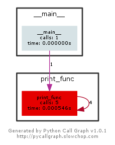

# Rekursiya və Backtracking

> Hal-hazırda backtracking sözünə öz dilimizdə tam uyğun tərcümə tapa bilmədim.
> Aşağıdakılar rus və türk dillərindən götürülüb:
> sarfınazar etmək, vazgeçmek, sözünden dönmek, aynı yoldan geri dönmek.
> отход, отступление, отступать

## 2.1 Giriş
Bu fəsildə, ən vacib məsələlərdən olan, *rekursiya* və onunla əlaqəli *backtracking* mövzularına toxunacağıq.

## 2.2 Rekursiya nədir?
Öz-özünü çağıran istənilən funksiya *rekursiv* funksiya adlanır. Problemin rekursiv həlli dedikdə, o başa düşülür ki, problem hər dəfə daha kiçik problemlə işləmək üçün özünün surətini(kopyasını) çağırır. Bu kimi, rekursiv addımlar, digər rekursiv çağırışlarla nəticələnə bilər.

Yəni, hər funksiya müəyyən problem üçün özü özünü bir neçə və yaxud sonsuz sayda çağıra bilər. Bu isə bizi vadar edir ki, rekursiv əməliyyatları(rekursiya) müəyyən şərtlər altında mütləq sonlandıraq, tamamlandıraq. Digər sözlə, rekursiya sonlu olmalıdır.

Daha sadə, izah etməli olsaq, rekursiya, bir problemin, daha kiçik, xırda hissələrlə, öz-özünü çağırması ardıcıllığıdır. Bir şeyi yadda saxlamaq lazımdır ki, bu ardıcıllıqlar, son nəticədə əsas problemə əsaslanmalıdırlar.

## 2.3 Nəyə görə rekursiya?
Rekursiya riyaziyyatdan götürülmüş faydalı bir üsuldur(metoddur). Rekursiv üsulla yazılmış kod, ümumən iterativ üsulla yazılan koddan daha qısa, kodu yazmaq daha sadə olur.

Rekursiya, bir-birinin oxşarı olan alt tapşırıqlar kimi göstərilə bilən daha böyük tapşırıqların həllində daha faydalı olur. Məsələn, sıralama, axtarış, kəsişmə problemlərinin, adətən, sadə rekursiv həlləri mövcuddur.

## 2.4 Rekursiv funksiyanın formatı haqqında
Rekursiv funksiya, bir tapşırığı icra etmək üçün, öz-özünü çağırmaqla alt tappşırıqları(subtasks) həll edir. Bir neçə icradan sonra, elə vəziyyət gəlir ki, alt tapşırıq daha öz-özünü çağırmadan icra olunur. Bu hala, əsas hal(base case) deyilir, harda ki, funksiya artıq rekursiv olmur(does not recur). Bundan öncəki, alt tapşırığı həll etmək üçün, funksiyanın öz-özünü çağırması hallarına isə kursiv hal deyilir(cursive case).

Rekursiv funksiyaya misal olaraq, faktorialın hesablanmasını göstərə bilərik. n! faktorial 1-dən n-ə qədər olan bütün ədədlərin hasilidir. Faktorialın açıqlaması:

```
n! = 1, əgər n = 0
n! = n * (n - 1)!, əgər n > 0
```
Bu tərif(açıqlama) çox asanlıqla, rekursiv üsulla göstərilə də bilər. Daha sadə desək, tapşırığın özü n!-dir, lakin bir də bunun alt tapşırığı var (n - 1)!.
Rekursiv hal üçün, n-nin 1-dən böyük hallarında,(n - 1)!-in dəyərini aşkarlamaq üçün funksiya öz-özünü çağırır və həmin qiyməti n-ə vurur.

Bu funksiyanın əsas halı(base case) n 0 və ya 1 olanda qeydə alınır. Bu zaman heç bir rekursiv çağırışa ehtiyac olmadan 1 qaytarılır.

Rekursiv üsulla faktorial hesablayan kod:

```
def factorial(n):
    if n == 0 or n == 1:
        return 1

    return n * factorial(n - 1)

print(factorial(10))
```

## 2.5 Rekursiya və yaddaş vizualizasiyası haqqında.
Bir şeyi qeyd etməliyik ki, hər rekursiv çağırış, yaddaşda həmin funksiyanın kopyasını saxlayır. Funksiya bitdikdən sonra(hər hansı məlumatı return etdikdə), məlumatı geri qaytaran həmin funksiya yaddaşdan silinir. Rekursiv kod çox sadə görsənir, əslində isə, vizualizasiya və kodu icrasını izləmək(tracing) çətinləşir.


```
def print_func(n):
    if n == 0: # funksiyanı bitirən əsas hal.
        return 0
    else:
        print(n)
        return print_func(n - 1) # rekursiv çağırış

print(print_func(4))
```

**Sual:** Yuxarıdakı `print_func()` funksiyası toplam neçə dəfə çağırılacaq.
**Cavab:** Toplamda 5 dəfə. 1 dəfə `print()` daxilində, 4 dəfə də rekursiv şəkildə

Aşağıdakı şəkilə diqqət yetirsək bunu aydın görərik. Sağ tərəfdəki ox öz-özünü 4 dəfə çağırmağa işarədir:



> Bu şəkli hazırlayan kod: [fesil2_2.5_pycallgraph.py](../Source_Code/python_kodlar/fesil2/fesil2_2.5_pycallgraph.py)

Digər tərəfdən, biz yuxarıda dedik ki, hər bir rekursiv çağırış yaddaşda saxlanılır. Yəni biz bu çağırışları istədiyimiz anda `stack frame`-də görə bilərik.
Bunu göstərmək üçün mən interaktiv debugger olan pdb-dən istifadə etmək istəyirəm. Pdb haqqında daha ətraflı oxuya bilərsiniz: [pdb doc](https://docs.python.org/3.5/library/pdb.html)


> pdb ilə kod nümunəsi: [fesil2_2.5_pdb.py](../Source_Code/python_kodlar/fesil2/fesil2_2.5_pdb.py)

```
$ python3 fesil2_2.5_pdb.py
> /home/shako/REPOS/Data_Structures_Algo_Python/Source_Code/fesil2_2.5_pdb.py(14)<module>()
-> print_func(4)
(Pdb) c
4
3
2
1
> /home/shako/REPOS/Data_Structures_Algo_Python/Source_Code/fesil2_2.5_pdb.py(6)print_func()
-> return 0
```

Bundan sonra, biz interaktiv debuggerin daxilində `where` əmrini yazsaq o bizə, ən yeni frame ən aşağıda olmaqla, `stack trace` çıxardacaq:

```
(Pdb) where
  /home/shako/REPOS/Data_Structures_Algo_Python/Source_Code/fesil2_2.5_pdb.py(14)<module>()
-> print_func(4)
  /home/shako/REPOS/Data_Structures_Algo_Python/Source_Code/fesil2_2.5_pdb.py(9)print_func()
-> return print_func(n - 1) # rekursiv çağırış
  /home/shako/REPOS/Data_Structures_Algo_Python/Source_Code/fesil2_2.5_pdb.py(9)print_func()
-> return print_func(n - 1) # rekursiv çağırış
  /home/shako/REPOS/Data_Structures_Algo_Python/Source_Code/fesil2_2.5_pdb.py(9)print_func()
-> return print_func(n - 1) # rekursiv çağırış
  /home/shako/REPOS/Data_Structures_Algo_Python/Source_Code/fesil2_2.5_pdb.py(9)print_func()
-> return print_func(n - 1) # rekursiv çağırış
> /home/shako/REPOS/Data_Structures_Algo_Python/Source_Code/fesil2_2.5_pdb.py(6)print_func()
-> return 0
```

Diqqət etsəniz, yuxarıda dediyimizin sübutu olaraq 4 rekursiv çağırışın hər birinin kopyasının var olduğunu görürük.

Bəs bizim faktorial kodumuz? Onu da debugger ilə çalışdırıb, icra edib, rekursiv çağırışlara və həmçinin `frame`-də yuxarı doğru(up komandası ilə) getməklə verilmiş `n` rəqəminin həmin an üçün dəyərinə baxa bilərik.

> Factorial + debugger kodumuz: [fesil2_2.5_factorial_pdb.py](../Source_Code/python_kodlar/fesil2/fesil2_2.5_factorial_pdb.py)

Debugger ilə istifadə nəticəsi:

```
$ python3 fesil2_2.5_factorial.py
> /home/shako/REPOS/Data_Structures_Algo_Python/Source_Code/fesil2/fesil2_2.5_factorial.py(12)<module>()
-> factorial(5)
(Pdb) c
> /home/shako/REPOS/Data_Structures_Algo_Python/Source_Code/fesil2/fesil2_2.5_factorial.py(6)factorial()
-> return 1
(Pdb) where
  /home/shako/REPOS/Data_Structures_Algo_Python/Source_Code/fesil2/fesil2_2.5_factorial.py(12)<module>()
-> factorial(5)
  /home/shako/REPOS/Data_Structures_Algo_Python/Source_Code/fesil2/fesil2_2.5_factorial.py(8)factorial()
-> return n * factorial(n - 1)
  /home/shako/REPOS/Data_Structures_Algo_Python/Source_Code/fesil2/fesil2_2.5_factorial.py(8)factorial()
-> return n * factorial(n - 1)
  /home/shako/REPOS/Data_Structures_Algo_Python/Source_Code/fesil2/fesil2_2.5_factorial.py(8)factorial()
-> return n * factorial(n - 1)
  /home/shako/REPOS/Data_Structures_Algo_Python/Source_Code/fesil2/fesil2_2.5_factorial.py(8)factorial()
-> return n * factorial(n - 1)
> /home/shako/REPOS/Data_Structures_Algo_Python/Source_Code/fesil2/fesil2_2.5_factorial.py(6)factorial()
-> return 1
(Pdb) p n
1
(Pdb) up
> /home/shako/REPOS/Data_Structures_Algo_Python/Source_Code/fesil2/fesil2_2.5_factorial.py(8)factorial()
-> return n * factorial(n - 1)
(Pdb) p n
2
(Pdb) up
> /home/shako/REPOS/Data_Structures_Algo_Python/Source_Code/fesil2/fesil2_2.5_factorial.py(8)factorial()
-> return n * factorial(n - 1)
(Pdb) p n
3
(Pdb) up
> /home/shako/REPOS/Data_Structures_Algo_Python/Source_Code/fesil2/fesil2_2.5_factorial.py(8)factorial()
-> return n * factorial(n - 1)
(Pdb) p n
4
(Pdb) up
> /home/shako/REPOS/Data_Structures_Algo_Python/Source_Code/fesil2/fesil2_2.5_factorial.py(8)factorial()
-> return n * factorial(n - 1)
(Pdb) p n
5
(Pdb) up
> /home/shako/REPOS/Data_Structures_Algo_Python/Source_Code/fesil2/fesil2_2.5_factorial.py(12)<module>()
-> factorial(5)
```

## 2.6 Rekursiya İterasiyaya qarşı
Rekursiya haqqında danışanda, ağıla gələn ilk suallardan biri budur ki, hansı daha yaxşıdır? İterasiya ya Rekursiya?
Bu suala cavab, bizim nə etmək istədyimizə bağlıdır. Rekursiv üsul problemi həll etməyi asanlaşdırır. Lakin, bu zaman da əlavə tələblər qoyur. Belə ki, hər bir rekursiv çağırış üçün bizə əlavə yaddaş lazım olur.

### Rekursiya
* Əsas hala(base case) çatdıqda, proqram dayanır.
* Hər öz çağırış(recursive call) əlavə `stack frame`(yaddaş) işğal edir.
* Sonsuz, bitməyən(əsas hala çatmayan) rekursiv çağırışlar, yaddaşın bitməsinə və `stack overflow` ilə nəticələnə bilər.
* Bəzi problemlərə, bu üsulla həllər yazmaq, daha sadə, daha anlaşıqlı və daha qısa olur.

### İterasiya
* Şərt doğru olmayanda proqram dayanır.
* Hər iterasiya əlavə kopyanın yaddaşda saxlanmasına ehtiyac duymur.
* Məsələyə, problemə, iterativ üsulla həll yazmaq, ilk baxışdan tam aydın olmaya bilir.

## 2.7 Rekursiya haqqında qeydlər
* Rekursiv alqoritmlərin, 2 halı var, rekursiv hal və əsas hal.
* Hər bir rekursiv funksiya, əsas hala çatdıqda sonlanmalıdır.
* Ümumən götürdükdə, iterativ həllər, rekursiv həllərdən daha üstün hesab olunur(öz çağırışların çoxluğu səbəbi ilə).
* Rekursiv üsulla həll oluna bilən, problemin həm də iterativ üsulla həlli var.
* Bəzi problemlər üçün, aydın iterativ üsul mövcud olmur.
* Bəzi problemlər, məhz elə rekursiv üsulun malıdır, ona tam uyğundur, bəziləri isə yox.

## 2.8 Rekursiv alqoritmlərə misal:
* Fibonaççi ardıcıllığı, Faktorialın tapılması
* Birləşdirməklə sıralama(Merge Sort), Cəld sıralama(Quick Sort)
* İkili axtarış(binary search)
* Hanoi qüllərləri problemi

## 2.9 Rekursiya məsələləri və həlləri:
Bir sıra rekursiv problemləri burda müzakirə edək.

**Məsələ 1** Hanoi qüllələri tapmacasının(puzzle) müzakirəsi

**Həlli** Hanoi qüllələri riyazi tapmacadır. 3 çubuq(qüllə) və verilmiş qədər disklərdən ibarətdir. Burdakı disklərin hər biri istənilən çubuğa sürüşdürülə bilən şəkildədir. Tapmaca, bir sütun(çubuq) üzərində olan disklərlə başlayır, disklər formaca kiçikdən böyüyə düzülür. Ən kiçik ölçüsü olan disk ən üstdə, ən böyüyü isə altda olmaqla yerləşdirilir. Məsələnin, məğzi bundan ibarətdir ki, bir qüllədə olan bütün diskləri digərinə keçirdək(ötürək, sürüşdürək). Lakin, bunu edərkən, müəyyən şərtlərə diqqət yetirməliyik:
* Hər dəfə yalnız bir disk sürüştürülə bilər.
* Hər sürüşmə, əvvəlki sütundan ən üst diski götürüb, digər sütuna(çubuğa) ötürməkdən ibarətdir.
* Bu zaman, bu disk, digər çubuqda, artıq mövcud olan disklərin üzərinə qoyulmalıdır.
* Ölçücə böyük olan disklər, özündən kiçiklərin üzərinə qoyula bilməz.

**Alqoritm**
* Ən üst (n - 1) qədər diskləri "Mənbə" sütundan, "Köməkçi" sütuna yerləşdir(sürüşdür). Faktiki olaraq, n - 1 sütununu "Köməkçi" sütuna yerləşdiririk.
* n-ci diski "Mənbə" sütundan, "Hədəf" sütuna yerləşdir,
* (n - 1) diskləri "Köməkçi" sütundan, "Hədəf" sütuna yerləşdir,
* Bu alqoritmdə, hər dəfə (n - 1) diskləri "Mənbə" sütundan, "Köməkçi" sütuna daşımaq, öz-özlüyündə yeni əməliyyat kimi görsənir və dolayısı ilə rekursiya üçün ideal istifadə yeridir.
3 diskli qüllə üçün bu problemi həll etsək belə çıxır ki, istənilən sayda qüllə üçün bunu həll etmiş olarıq.
Məsələni vizual olaraq göstərmək üçün aşağıdakı gif faylı burda yerləşdirirəm:


İndi isə kodumuzu yazaq:
> Hanoi qulleleri kodumuz: [fesil2_2.9_hanoi_qulleleri.py](../Source_Code/python_kodlar/fesil2/fesil2_2.9_hanoi_qulleleri.py)

```
def hanoi_qulleleri(disk_sayi, menbe_sutun, komekci_sutun, hedef_sutun):
  print "hanoi_qulleleri( ", disk_sayi, menbe_sutun, komekci_sutun, hedef_sutun, " cagrildi...)"
  if disk_sayi:
    # (n - 1) sutununu menbeden komekciye yerleshdirmek
    hanoi_qulleleri(disk_sayi-1, menbe_sutun, hedef_sutun, komekci_sutun)
    # deyildiyi kimi, n-ci diski menbeden hedefe yerleshdiririk
    if menbe_sutun:
        disk = menbe_sutun.pop()
        print("Disk {}-in menbe_sutun-dan hedef_sutun-a yerleshdirilmesi".format(disk))
        hedef_sutun.append(disk)
    # (n - 1) sutununu komekciden hedefe yerleshdiririk
    hanoi_qulleleri(disk_sayi-1, komekci_sutun, menbe_sutun, hedef_sutun)


menbe_sutun = [3, 2, 1]
hedef_sutun = []
komekci_sutun = []
hanoi_qulleleri(len(menbe_sutun), menbe_sutun, komekci_sutun, hedef_sutun)

print("son netice")
print(menbe_sutun, komekci_sutun, hedef_sutun)     
```

Kodu icra etdikdə belə bir mənzərə ilə qarşılaşırıq:

```
$ python3 fesil2_2.9_hanoi_qulleleri.py
hanoi_qulleleri(  3 [3, 2, 1] [] []  cagrildi...)
hanoi_qulleleri(  2 [3, 2, 1] [] []  cagrildi...)
hanoi_qulleleri(  1 [3, 2, 1] [] []  cagrildi...)
hanoi_qulleleri(  0 [3, 2, 1] [] []  cagrildi...)
Disk 1-in menbe_sutun-dan hedef_sutun-a yerleshdirilmesi
hanoi_qulleleri(  0 [] [3, 2] [1]  cagrildi...)
Disk 2-in menbe_sutun-dan hedef_sutun-a yerleshdirilmesi
hanoi_qulleleri(  1 [1] [3] [2]  cagrildi...)
hanoi_qulleleri(  0 [1] [2] [3]  cagrildi...)
Disk 1-in menbe_sutun-dan hedef_sutun-a yerleshdirilmesi
hanoi_qulleleri(  0 [3] [] [2, 1]  cagrildi...)
Disk 3-in menbe_sutun-dan hedef_sutun-a yerleshdirilmesi
hanoi_qulleleri(  2 [2, 1] [] [3]  cagrildi...)
hanoi_qulleleri(  1 [2, 1] [3] []  cagrildi...)
hanoi_qulleleri(  0 [2, 1] [] [3]  cagrildi...)
Disk 1-in menbe_sutun-dan hedef_sutun-a yerleshdirilmesi
hanoi_qulleleri(  0 [3] [2] [1]  cagrildi...)
Disk 2-in menbe_sutun-dan hedef_sutun-a yerleshdirilmesi
hanoi_qulleleri(  1 [1] [] [3, 2]  cagrildi...)
hanoi_qulleleri(  0 [1] [3, 2] []  cagrildi...)
Disk 1-in menbe_sutun-dan hedef_sutun-a yerleshdirilmesi
hanoi_qulleleri(  0 [] [] [3, 2, 1]  cagrildi...)
son netice
[] [] [3, 2, 1]
```


**Məsələ 2** Verilmiş massivin sıralanmış olduğunu aşkarlayın.

**Həlli**
> Kod faylı: [fesil2_2.9_is_array_sorted.py](../Source_Code/python_kodlar/fesil2/fesil2_2.9_is_array_sorted.py)

```
def massiv_siralidirmi(massiv):
    print("Yeni massiv : {}".format(massiv))
    # Esas hal
    if len(massiv) == 1:
        return True
    # Rekursiya
    if massiv[0] <= massiv[1] and massiv_siralidirmi(massiv[1:]):
        return True
    else:
        return False

massiv1 = [23, 34, 45, 56, 88, 97, 101, 125]
# True qayitmalidir
print(massiv_siralidirmi(massiv=massiv1))

massiv2 = [23, 34, 45, 56, 88, 97, 101, 125, 5]
# False qayitmalidir
print(massiv_siralidirmi(massiv2))
```

```
$ python3 fesil2_2.9_is_array_sorted.py
Yeni massiv : [23, 34, 45, 56, 88, 97, 101, 125]
Yeni massiv : [34, 45, 56, 88, 97, 101, 125]
Yeni massiv : [45, 56, 88, 97, 101, 125]
Yeni massiv : [56, 88, 97, 101, 125]
Yeni massiv : [88, 97, 101, 125]
Yeni massiv : [97, 101, 125]
Yeni massiv : [101, 125]
Yeni massiv : [125]
True
Yeni massiv : [23, 34, 45, 56, 88, 97, 101, 125, 5]
Yeni massiv : [34, 45, 56, 88, 97, 101, 125, 5]
Yeni massiv : [45, 56, 88, 97, 101, 125, 5]
Yeni massiv : [56, 88, 97, 101, 125, 5]
Yeni massiv : [88, 97, 101, 125, 5]
Yeni massiv : [97, 101, 125, 5]
Yeni massiv : [101, 125, 5]
Yeni massiv : [125, 5]
False
```

# 2.10 Backtracking nədir?
Backtracking özlüyündə `brute force` üsulun inkişaf etmiş formasıdır. Backtracking zamanı, problemin həllinin sistematik olaraq mümkün bütün həllərin arasından axtarışı həyata keçirilir. Bütün mümkün opsiyalardan, hər hansı birini seçirik, əgər seçdiyimiz opsiya bizim problemi həll edirsə, o zaman biz həlli print edirik. Yox əgər seçdiyimiz opsiya problemi həll etmədisə, o zaman geri dönüb, mümkün həllər arasından digər birini seçirik və beləcə problemi həll edənə qədər davam edirik. Əgər, mümkün opsiyalar arasında problemin həlli tapılmırsa, o zaman belə nəticəyə gəlirik ki, problemin həlli yoxdur.

Backtracking rekursiyanın bir formasıdır. Adətkar ssenari belə olur ki, biz hər hansı opsiyalarla(seçimlərlə) qarşılaşırıq və onlardan birini seçməli oluruq. Seçim etdikdən sonra isə yeni opsiyalar gəlir. Bu prosedur, son nəticəyə gəlib çıxana qədər, təkrarlanmaqda davam edir. Əgər siz, düzgün ardıcıllıqları seçmisinizsə, sizin üçün son hal hədəf halıdır, əks təqdirdə isə yox.
Backtracking, seçməli tree/graph traversal metodu kimi düşünülə bilər. Ağac(tree) hər hansı başlanğıc nöqtəsini(root node) və final(son) hədəf halını(goal state) - yarpaqlardan birini göstərmək üsuludur. Adi `brute force` üsul, müəyyən hallarda sonsuz sayda opsiyalara gətirib çıxara bilir. Backtracking bizə bundan yayınmaqda kömək edir. Backtracking sanki, saflaşdırılmış `brute force`-dur.
Hər node-da, biz açıq-aşkar mümkün olmayan opsiyaları aradan çıxardırıq və beləcə rekursiv şəkildə potensial lazımlı opsiyaları seçirik.

# 2.11 Backtracking alqoritmlərinə misal olaraq
* İkili stringlər(binary strings) - bütün binary string-ləri generasiya etmək.
* N-Queens problemi
* Knapsack problemi
* Hamiltonian Cycles
* Qraf rəngləmə problemi

# 2.12 Backtracking: məsələlər və həllər

**Məsələ 3** Bütün ikili stringləri n bitlərlə generasiya edin. Qəbul edirik ki, A[0..n-1] n ölçülü massivdir.
Məsələ adından dəhşətli görsənə bilər, lakin, qısa olaraq bizə elə bir funksiya lazımdır ki, məsələn, n = 3 ötürdükdə, 3 bitli bütün mümkün variantları bizə sıralasın.
Yəni belə bir şey:
```
n = 3
bin_str = [000, 100, 010, 001, 110 101, 011, 111]
```

Aşağıdakı kod parçası bu məsələni rekursiv üsulla həll edir:
> Nümunə kod: [fesil2_2.12_bit_strings_recursion.py](../Source_Code/python_kodlar/fesil2/fesil2_2.12_bit_strings_recursion.py)

```
def bin_str_list(n):
      if n == 0:
            #əsas hal
            return ['']
      else:
            # Rekursiya
            return [i + '0' for i in bin_str_list(n-1)] + [i + '1' for i in bin_str_list(n-1)]

print(bin_str_list(4))
```

Kodun icrasından alınan nəticə:

```
$ python3 fesil2_2.12_bit_strings_recursion.py
['0000', '1000', '0100', '1100', '0010', '1010', '0110', '1110', '0001', '1001', '0101', '1101', '0011', '1011', '0111', '1111']
```

Maraq üçün qeyd edək ki, Python-da `itertools` adlı çox gözəl kitabxana var ki, biz onun da köməyi ilə də bu problemi həll edə bilərik:
Aşağıdakı kod parçasının icrası da eyni nəticəni bizə verir:

> Nümunə kod: [fesil2_2.12_bit_strings_itertools.py](../Source_Code/python_kodlar/fesil2/fesil2_2.12_bit_strings_itertools.py)

```
from itertools import product
n = 4
bin_str_list = [''.join(p) for p in product('01', repeat=n)]

print(bin_str_list)
```
