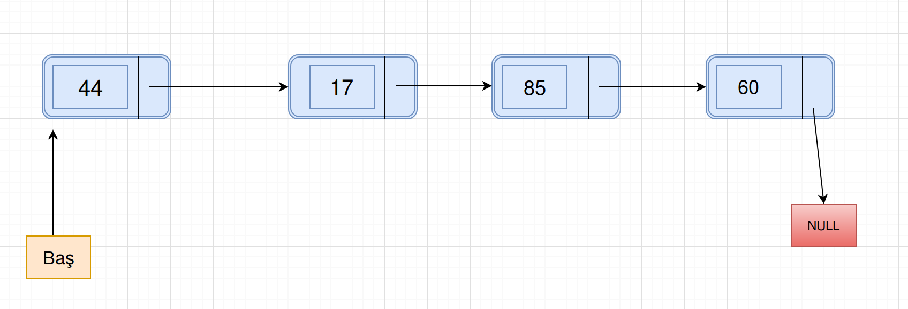

# Bağlı listlər(linked lists)

## Bağlı list nədir?
Bağlı list, məlumat kolleksiyalarını(data collections) saxlamaq üçün istifadə olunan məlumat strukturudur(data structure).
Bağlı listin aşağıdakı özünəməxsus xüsusiyyətləri var:
* Ardıcıl elementlər bir-birinə pointerlərlə bağlıdır
* Ən sonuncu element NULL-a işarə edir(points to NULL)
* Proqramın icrası zamanı, bağlı list böyüyüb, kiçilə bilər.
* Sistemin yaddaşı icazə verdiyi müddətcə, nə qədər lazımdırsa, o qədər ölçüyə böyüyə bilər.
* Bağlı listlər, lazımsız yerə yaddaş tutmur(pointerlər üçün tutduğundan başqa), yəni yaddaş list böyüdükcə,tələb olduqca ayrılır.

