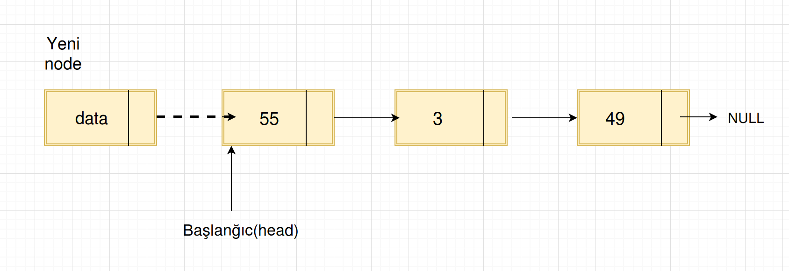
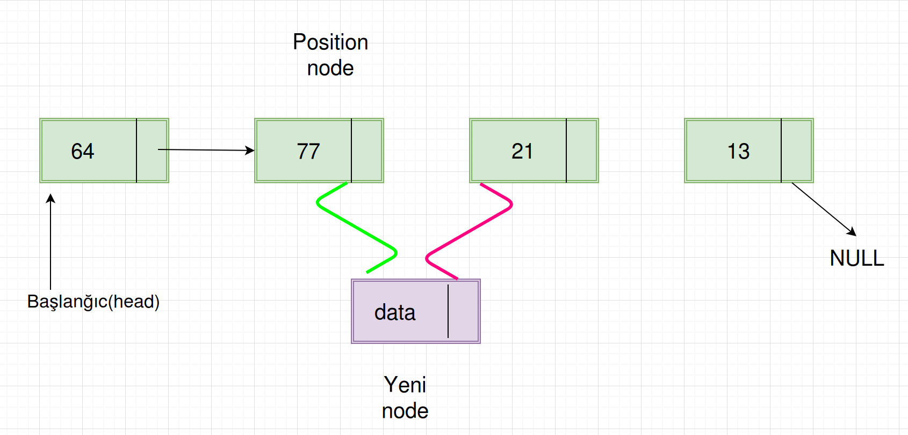
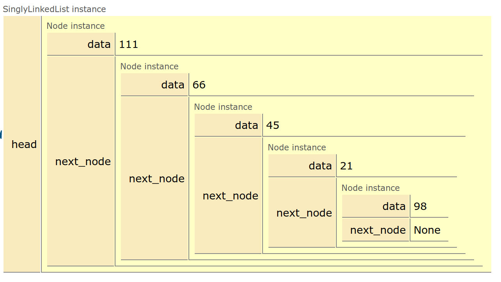

# Əlaqəli listlər(linked lists)[singly linked lists]

## 3.1 Əlaqəli list nədir?
Əlaqəli list, məlumat kolleksiyalarını(data collections) saxlamaq üçün istifadə olunan məlumat strukturudur(data structure).
Əlaqəli listin aşağıdakı özünəməxsus xüsusiyyətləri var:
* Ardıcıl elementlər bir-birinə pointerlərlə əlaqəlidir
* Ən sonuncu element NULL-a işarə edir(points to NULL)
* Proqramın icrası zamanı, əlaqəli list dinamik olaraq böyüyüb kiçilə bilər.
* Sistemin yaddaşı icazə verdiyi müddətcə, nə qədər lazımdırsa, o qədər ölçüyə böyüyə bilər.
* Əlaqəli listlər, lazımsız yerə yaddaş tutmur(pointerlər üçün tutduğundan başqa), yəni list böyüdükcə, dinamik olaraq lazımi yaddaş sahəsi ayrılır.


## 3.2 Əlaqəli listlər ADT
Aşağıdakı əməliyyatlar, Əlaqəli listləri ADT edir:

**Əsas Əlaqəli list əməliyyatları**
* Daxil etmə: listə elementləri daxil edir
* Silmə: listdən elementi silir və verilmiş pozisiyanı qaytarır

**Köməkçi Əlaqəli list əməliyyatları**
* Listin silinməsi: listdən bütün elementləri silir.
* Sayma: listdəki elementlərin sayını qaytarır.

## 3.3 Nəyə görə Əlaqəli listlər?
Əlaqəli listlərlə eyni işi görən bir çox digər məlumat strukturu var. Əlaqəli listləri müzakirə etməzdən əvvəl, massivlə onun fərqini bilməyimiz yaxşı olardı. Əlaqəli listlər və massivlər, hər ikisi, məlumat kolleksiyalarını saxlayır, odur ki, bunların fərqini görmək lazımdır. Daha dəqiq desək, hansı halda bizə massiv, hansı halda isə əlaqəli listlər lazım olar.

## 3.4 Massivlər haqqında
Massivin elementlərini saxlamaq üçün, bütöv massiv üçün, yaddaş ayrılır. Massivin elementlərini, onların indekslərindən istifadə etməklə, sabit vaxt ərzində oxumaq olar. Massivin indeks sıralaması 0-dan başlayır, yəni birinci element 0-cı indeksdə yerləşir.

**Nəyə görə elementlərə çatmaq üçün sabit vaxt gedir?**
Massivin elementinə çatmaq üçün, həmin elementin yaddaş ünvanını bilməyimiz lazımdır. Bu yaddaş ünvanı, əsas yaddaş ünvanından(base address) hesablanır. Bu məqsədlə, elementin tipinin həcmini(size)  elementin indeks nömrəsinə vururuq və daha sonra  əsas yaddaş ünvanının üzərinə gəlirik. Dolayısı ilə bizim üçün bu əməliyyat 1 `vurma` və 1 `toplama` əməliyyatından ibarətdir. Bu əməliyyatlar da özləri sabit vaxt aparır.
Daha da dəqiqləşdirsək, massivin elementinin indeks üzrə əldə olunması əməliyyatı, O(1) + O(1) notasiya şəklində göstərilə bilər. Burdan da, keçmiş fəsillərdə dediklərimizə əsaslanaraq deyirik ki, bu problemin mürəkkəbliyi O(1) yəni, sabit vaxtdır.

Düstur kimi qeyd etsək:

`Elementin yaddaşdakı ünvanı = Əsas yaddaş ünvanı(base memory address) + indek nömrəsi * elementin yaddaşda tutduğu yer`

Python dilində, C/C++-dan fərqli olaraq biz, pointer yaddaş ünvanlarına bir başa müraciət edə bilmirik və ümumiyyətlə bütün bu işləri CPython(mənim hal hazırda istifadə etdiyim Python) arxa planda yerinə yetirir. Odur ki, Python-la bu əməliyyat, yəni pointer hesablamanı göstərmək düzgün deyil.
Bu məsələni aşağıdakı məqalə çox yaxşı izah edir:
[understanding-python-variables-as-pointers](http://scottlobdell.me/2013/08/understanding-python-variables-as-pointers/)

Bu şəkil həmin məqalədəndir:


Əgər fikir versəniz, görərsiniz ki, C++ kodda massivin elementləri üçün ayrılan yaddaş ünvanları  ardıcıldır və 2 ünvan arasındakı qiymət elementin ölçüsünə(həcm, size) bərabərdir. Python tərəfdə isə heç bir ardıcıl yaddaş ünvanı nömrələri görmürük. Dolayısı ilə, pointer hesablaması apara bilmirik.

Lakin istənilən Python obyektin yaddaş ünvanları və.s baxmaq maraqlıdırsa, aşağıdakı kod sizə kömək ola bilər.
Qeyd edək ki, əgər massivin elementləri sıralıdırsa, bu zaman yaddaş ünvanlarında müəyyən ardıcıllıq yaranır:

```
import array

massiv = array.array('i', [1, 3, 30, 74, 200])
```

```
$ python -m pdb test_py.py
(Pdb) p massiv
array('i', [1, 3, 30, 74, 200])
(Pdb) id(massiv[0])
94822287557792
(Pdb) id(massiv[1])
94822287557856
(Pdb) id(massiv[2])
94822287558720
(Pdb) id(massiv[3])
94822287560128
(Pdb) id(massiv[4])
94822287564160
(Pdb) hex(id(massiv[0]))
'0x563d88c444a0'
(Pdb) hex(id(massiv[1]))
'0x563d88c444e0'
(Pdb) hex(id(massiv[2]))
'0x563d88c44840'
(Pdb) hex(id(massiv[3]))
'0x563d88c44dc0'
(Pdb) hex(id(massiv[4]))
'0x563d88c45d80'
 ```

 Gördüyünüz kimi müəyyən ardıcıllıq nəzərə çarpır.

 **Massivin üstünlükləri**
 * İstifadəsi asan və sadədir.
 * Massivin elementlərinə sürətli çatmaq olur.(sabit vaxtda)

**Massivin zəif cəhətləri**
* Əvvəlcədən bütün yaddaşı ayıraraq, istifadə olunmayan yaddaşı işğal edir.
* Sabit ölçülüdür: massivin həcmi, yaradıldıqda verilir və statikdir.
* Pozisiya əsaslı element daxil etmə mürəkkəbdir: massivə verilmiş pozisiyaya element daxil etmək üçün, biz digər elementləri sürüşdürməliyik. Bu bizə istədiyimiz yerə elementi daxil etmək üçün pozisiya yaradacaq. Burda ən pis hal o ola bilər ki, biz yeni elementi massivin əvvəlinə yerləşdirmək istəyirik. Bu zaman sağda qalan bütün elementlər sürüşdürülməli olacaqlar ki, bu da olduqca dəyərli(bahalı, expensive) əməliyyatdır.

**Dinamik massivlər**
Dinamik massiv(digər adları, arta bilən massiv, ölçüsü dəyişdirilə bilən massiv, massiv listi) təsadüfi girişli(random-access), dəyişən ölçülü(variable-size) list data strukturudur. Dinamik massiv, elementlərin ehtiyac olduqca, əlavə edilib, siliməsinə icazə verir.
Dinamik massiv yaratmağın ilk ağıla gələn üsulu budur ki, ilk öncə sabit ölçülü massiv yaradırıq, sabit ölçülü massiv dolanda, köhnəsindən 2 dəfə çox ölçüsü olan daha bir sabit ölçülü massiv yaradıb, elementləri ora daxil edirik.

> Növbəti fəsillərdə dinamik massivlərin Stack, Queue və Hashing mövzularında istifadəsini göstərəcəyik.

**Əlaqəli listlərin üstünlükləri**
Əlaqəli listlərin üstün və zəif cəhətləri var. Əlaqəli listlərin üstünlüyü budur ki, onlar sabit vaxt ərzində genişləndirilə bilərlər.
Daha sadə dildə izah etməyə çalışsaq, massivlərdə dediyimiz, yeni massiv yaradıb, köhnəni ora kopyalamaq və.s kimi çox vaxt aparan əməliyyatlara burda ehtiyac qalmır. Əlaqəli listi cəmi 1 elementlə başlayıb sonra sabit vaxt(constant time) ərzində yeni elementlər əlavə edə bilərik.

**Əlaqəli listlərin zəif cəhətləri**
Əlaqəli listi zəif salan, bir neçə cəhətləri var. Ən böyük çatışmazlığı, müəyyən bir elementə çatmaq üçün istifadə etdiyi vaxtdır. Əgər xatırlasaq, demişdik ki, massiv üçün bu vaxt O(1)-dir. Lakin, əlaqəli listdə, elementə çatmaq ən pis halda O(n)-dir. Massivin digər üstünlüyü, onun elementlərinin ərazi(yaddaş) yaxınlığıdır. Belə ki, massivin elementləri yuxarıdakı missallarda da göstərildiyi kimi, ardıcıl ayrılmış yaddaş ünvanlarında yerləşirlər. Dolayisi ilə, onlar fiziki olaraq bir-birinə yaxındırlar və bu müasir CPU keşləmə(caching) metodlarından səmərəli istifadə etməyə imkan verir.

Bəzən əlaqəli listləri idarə etmək də çətin ola bilər. Deyək ki, əlaqəli listdə sonuncu element silinib, bu o deməkdir ki, ondan bir əvvəlki element artıq, silinmiş sonuncu elementə point etməməlidir. Yəni, biz bu sondan bir əvvəlki elementi sonuncu etməyimiz üçün, onun pointer-ini NULL-a qeyd etməliyik. Bu o deməkdir ki, biz listi əvvəldən axıra gəzib bu elementi tapıb, daha sonra da pointer-ini dəyişməliyik.

Sonda, onu da qeyd edək ki, əlaqəli listlərdə pointerlər də yaddaş tutduğu üçün, bu da əlavə yaddaş itkisi hesab olunur.

## 3.5 Əlaqəli listlərin massiv və dinamik massivlərlə müqayisə cədvəli

| Parametr       | Əlaqəli list        | Massiv  | Dinamik massiv |
| ------------- |:-------------:| -----:| -------------:|
| Indeksləmə    | O(n)     | O(1)| O(1)
| Əvvələ yazma və silmə  | O(1) | O(n) əgər massiv tam dolu deyilsə(elementləri sürüşdürmək üçün) | O(n)
| Ən sona yazma | O(n)   | O(1) əgər massiv tam dolu deyilsə | O(1), əgər massiv tam dolu deyilsə. O(n), əgər massiv tam doludursa
| Ən sondan silmə | O(n)    | O(1) | O(n)
| Ortaya yazma    | O(n)    | O(n), əgər massiv tam dolu deyilsə(elementləri sürüşdürmək üçün) | O(n)
| Ortadan silmə   | O(n)    | O(n), əgər massiv tam dolu deyilsə(elementləri sürüşdürmək üçün) | O(n)                 | Kubik               | Matrisin vurulması || O(n)    | O(n), əgər massiv tam dolu deyilsə(elementləri sürüşdürmək üçün) | O(n)
| Əlavə tutulan yaddaş(wasted memory)| O(n) pointerlər üçün        | 0 | O(n)


## 3.6 Birtərəfli əlaqəli listlər(singly linked lists)
Adətən əlaqəli list dedikdə, elə birtərəfli əlaqəli list başa düşülür. Bu list verilmiş qədər node-dan ibarət olur. Hər node-da özündən sonrakı node-a pointer saxlanılır. Ən sonuncu node-un pointeri isə NULL-a baxır, bu da listin sonunu göstərir.


Yuxarıdakı şəkildən də bu aydın görsənir.
Bir şeyi də qeyd etməliyik ki, NULL Python-da None-dır.

Bu mövzunu biraz daha izah edək. Əlaqəli listin əsəs yaradıcı bloku onun node-udur. Hər node ən azı 2 növ informasiyanı özündə saxlamalıdır. İlk öncə, təbii ki, hər node-də listin faktiki elementi yerləşməlidir. Bunun adına `data field` deyilir.
İkinci, hər node sonrakı node-a reference saxlamalıdır.

İndi isə gəlin integerlərdən ibarət Əlaqəli list üçün tip elan edək:

> Nümunə kod: [fesil3_3_6_singly_linked_lists.py](../Source_Code/python_kodlar/fesil3/fesil3_3_6_singly_linked_lists.py)

```
# Birtərəfli(təktərəfli) əlaqəli list Node
class Node:

    # konstruktor
    def __init__(self, data=None, next_node=None):
        self.data = data
        self.next_node = next_node # faktiki pointer

    # node-un data field-ini mənimsətmək  üçün metod
    def set_data(self, data):
        self.data = data

    # node-un data field-ini almaq üçün metod
    def get_data(self):
        return self.data

    # node-un növbəti field-ini mənimsətmək üçün metod
    def set_next(self, next_node):
        self.next_node = next_node

    # node-un növbəti field-ini almaq üçün metod
    def get_next_node(self):
        return self.next_node

    # əgər bir node sonrakına point edirsə, true qaytar
    def has_next(self):
        return self.next_node is not None
```
```
//java kode
//Birtərəfli(təktərəfli) əlaqəli list Node
public class Node {
    public int data;
    public Node next;

    //konstruktor
    public Node(int data, Node next) {
        this.data = data;
        this.next = next;
    }

    //node-un data field-ini mənimsətmək  üçün metod
    public void set_data(int data){
        this.data = data;
    }

    //node-un data field-ini almaq üçün metod
    public int get_data(){
        return this.data;
    }
    //node-un növbəti field-ini mənimsətmək üçün metod
    public void set_next(Node node){
       this.next = node;
    }
    //node-un növbəti field-ini mənimsətmək üçün metod
    public Node get_next_node(){
        return this.next;
    }

    //node-un növbəti field-ini almaq üçün metod
    public boolean has_next(){
        return this.next != null ? true : false;
    }
}
```

**Listə aid bəzi sadə əməliyyatlar**
* Listi qətt etmək(traversing)
* Listə element daxil etmək
* Listdən element silmək

**Listi qətt etmək(traversing linked list)**

Qəbul edirik ki, `baş = head` listin birinci node-una point edir(işarə edir).
Məntiqi olaraq, Əlaqəli listi əvvəldən axıra qətt etmək, aşağıdakı addımları etmək deməkdir:
* Pointerləri izləyirik
* İrəlilədikcə node-da olan dəyərləri və yaxud, sayı göstəririk
* NULL gördükdə dayanırıq.

İndi isə gəlin bunun kodunu yazaq.
Biz yuxarıda Node adlı istifadəçi tərəfindən təyin olunmuş tipi elan etdik. Lakin, faktiki Əlaqəli listin özünü yazmamışıq.
Aşağıdakı koda diqqət yetirək:

> Nümunə kod: [fesil3_3_6_singly_linked_lists.py](../Source_Code/python_kodlar/fesil3/fesil3_3_6_singly_linked_lists.py)

```
class SinglyLinkedList:
    def __init__(self, head=None):
        self.head = head

    def list_size(self):
        current = self.head
        count = 0
        while current:
            count += 1
            current = current.get_next_node()
        return count
```
```
//java kod
public class SinglyLinkedList {

    private Node head;

    public List() {
        head = null;
    }

    public int list_size(){
        Node current = head;
        int count = 0;
        while(current != null){
            count++;
            current = current.get_next_node();
        }
        return count;
    }

}
```
Kodu biraz izah edək. Birtərəfli əlaqəli list üçün onun başlanğıcını default None(NULL) olaraq konstruktorda qeyd etmişik. Bunun səbəbi odur ki, çox böyük ehtimal biz işə boş list yaratmaqla başlayacayıq. Yəni, listin head-ini None etməkdə fayda var.
`list_size()` metodu sadəcə pointerləri izləməklə current `None(NULL)`-a çatana qədər node sayını hesablamaqla məşğuldur.

Bizim halda, teoriyamıza əsasən bizim listin ölçüsü 0 olmalıdır:

```
$ python3 -m pdb fesil3_3_6_linked_lists.py

(Pdb) pbj = SinglyLinkedList()
(Pdb) pbj.list_size()
0
```

```
//Java kod
public static void main(String[] args) {
    List l = new List();
    System.out.println(l.list_size());
}
Nəticə: 0
```
**Birtərəfli əlaqəli listə element daxil etmək**

Birtərəfli əlaqəli listə daxil etmə(insert) əməliyyatının 3 halı var:
* Listə yeni node-u, `head`-dən əvvəl salmaq, yəni başlanğıca yerləşdirmək.
* Listə yeni node-u ən sona daxil etmək.
* Listə yeni node-u ortaya daxil etmək(ixtiyarı yerə)

**Birtərəfli əlaqəli listin əvvəlinə node daxil etmək**

Bu halda, yeni node, hal-hazırkı başlanğıc node-dan əvvələ daxil olunur.
Bu əməliyyat zamanı yalnız, yeni əlavə olunan node-un növbəti pointeri(next pointer) dəyişdirilməlidir və bu da 2 addımda yerinə yetirilir:
* Yeni node-un növbəti pointerini, hal-hazırkı başlanğıc node-a doğrultmaq lazımdır.



* Head pointer-i yeni node-a doğrultmaq lazımdır.


Təbii ki, sözlərimizi kodla da ifadə etməliyik. Yuxarıdakı `SinglyLinkedList` sinfinə əlavə bir metod yazırıq:

```
def insert_at_beginning(self, data):
      new_node = Node()
      new_node.set_data(data)

      if self.list_size() == 0:
          self.head = new_node
      else:
          new_node.set_next(self.head)
          self.head = new_node
```
```
// Java kod
public void insert_at_beginning(int data){
        Node node = new Node();
        node.set_data(data);
        if(list_size() == 0) head = node;
        else{
            node.set_next(head);
            head = node;
        }
    }
```
Kodu biraz daha izah edək. İlk öncə Node() sinfini çağırmaqla yeni boş node yaradırıq, daha sonra həmin yeni node-a data əlavə edirik, daha sonra yoxlayırıq ki, əgər list boşdursa, o zaman elə yeni əlavə edəcəyimiz node-un özünü head edirik(çünki onsuz da listdə cəmi 1 node oldu və o da head olmalıdır).
Yox əgər, listdə element varsa, yeni əlavə etdiyimiz node-un next pointerini dəyişib bizim hal-hazırkı head edirik(sanki onu head-dən əvvələ salırıq).
Daha sonra da, yeni node-u nəhayət head edirik, çünki o artıq listdə birincidir.
Kodumuzu test edirik:
```
$ python3 -m pdb fesil3_3_6_linked_lists.py

(Pdb) obj = SinglyLinkedList()
(Pdb) obj.insert_at_beginning(101)
(Pdb) obj.insert_at_beginning(11)
(Pdb) obj.insert_at_beginning(99)
(Pdb) obj.list_size()
3
```
```
// Java kod
public static void main(String[] args){
      SinglyLinkedList l = new SinglyLinkedList();
      l.insert_at_beginning(101);
      l.insert_at_beginning(11);
      l.insert_at_beginning(99);
      l.list_size(); // Nəticə: 3
}
```

Məsələ sizə hələ də mücərrəd qalıb? O zaman onu biraz vizuallaşdıraq. Bu məqsədlə mənim çox sevdiyim bir saytdan istifadə edəcəyik - [pythontutor](http://www.pythontutor.com/visualize.html)

Daha konkret desək aşağıdakı linkə daxil olsanız bizim kodumuzun vizual nəticəsini görmüş olarsınız:

[Kodun vizual nəticəsi](https://goo.gl/pSKkjP)

Bizə əsas maraqlı olan isə aşağıdakı şəkildə aydın görsənir:


Canlı olaraq birtərəfli əlaqəli list data strukturunu görmüş olduq.

**Birtərəfli əlaqəli listin sonuna node daxil etmək**
Bu halda biz 2 pointeri dəyişməli oluruq. Ən sonuncu node-un pointerini və yeni əlavə edilmiş node-un pointerini.
Daha dəqiq desək, ən sonuncu node artıq yeni əlavə edilmiş node-a işarə etməlidir. Yeni əlavə edilmiş node isə NULL-a.

* Yeni node-un next pointerini NULL-a yönləndiririk


* Sonuncu node-un next pointeri yeni node-a baxır:


İndi isə bu əməliyyatın kodunu yazaq:

```
def insert_at_end(self, data):
      new_node = Node()
      new_node.set_data(data)

      current = self.head
      while current.get_next_node() is not None:
          current = current.get_next_node()

      current.set_next_node(new_node)
```
```
//Java kod
 public void insert_at_end(int data){
        Node node = new Node();
        node.set_data(data);
        Node current = head;
        while(current.get_next_node() != null)
            current = current.get_next_node();

        current.set_next(node);
}
```
Kodu izah etməyə çalışaq.
İlk öncə Node() tipi ilə node-umuzu yaradırıq, bu zaman new_node-un həm data-sı həm də next pointeri NULL olaraq inisializasiya olunur.
Daha sonra, funksiya üçün göndərilən dəyəri new_node-un data-sına mənimsədirik. Növbəti addımda, ən sonuncu node-u tapmaqla məşğul oluruq(current-in son aldığı dəyər ən son node-dur). Ən sonda, sonuncu node-un next pointerini yeni node-a mənimsədirik. Qeyd edək ki, burda yeni node-un next pointerini NULL-a yönləndirməyə ehtiyac qalmir çünki, bunu artıq `new_node = Node()` kodu edib.

Kodumuzu test edirik:

```
$ python3 -m pdb fesil3_3_6_linked_lists.py

(Pdb) obj = SinglyLinkedList()
(Pdb) obj.insert_at_beginning(33)
(Pdb) obj.insert_at_beginning(21)
(Pdb) obj.list_size()
2
(Pdb) obj.insert_at_end(44)
(Pdb) obj.insert_at_end(13)
(Pdb) obj.list_size()
4
```
```
//Java kod
public static void main(String[] args){
      SinglyLinkedList l = new SinglyLinkedList();
      l.insert_at_beginning(33);
      l.insert_at_beginning(21);
      l.list_size(); // Nəticə: 3

      l.insert_at_end(44);
      l.insert_at_end(13);
      l.list_size(); // Nəticə: 4
}
```
Deməli bizim sonuncu node-umuzun data-sı 13 olacaq:


**Birtərəfli əlaqəli listin ortasına node daxil etmək**
Ola bilər ki, bizə hər hansı pozisiya verilsin və tələb olunsun ki, yeni node-u bu pozisiyaya daxil edək.
Bu işi iki addımda edəcəyik:

* 3 nömrəli pozisiyaya elementi daxil etmək üçün, 2-ci pozisiyada dayanmaqlıyıq. Bu o deməkdir ki, biz 2 node irəli gedib, yeni node-u daxil etməliyik. Aşağıdakı şəkilə diqqət yetirək. 2-ci node-u pozisiya node-u adlandırsaq, belə çıxır ki, yeni node, həmin pozisiya node-un işarə etdiyi(göstərdiyi, point etdiyi) node-a baxmalıdır.


* Daha sonra, pozisiya node-un next pointer-i yeni node-a baxmalıdır,işarə etməlidir. Beləcə biz yeni node-u sanki listin ortasına salmış oluruq.



İndi isə müvafiq kodumuzu yazaq:
> Qeyd: Kodun izahı, kod daxilindəki kommentlərdə qeyd olunub.

```
def insert_at_pos(self, pos, data):
      # Əgər düzgün pozisiya verilmirsə, None qaytar
      if pos > self.list_size() or pos < 0:
          print("Pozisiya səhvdir, None qaytarıram..")
          return None
      else:
          # Əgər pozisiya 0-dırsa, bu o deməkdir ki, biz listin əvvəlinə daxil etmək istəyirik
          if pos == 0:
              print("Əvvələ daxil etmə...")
              self.insert_at_beginning(data)
          # Əgər pozisiya list-in node sayına bərabərdirsə, bu o deməkdir ki, node-u listin sonuna daxil etmək lazımdır
          elif pos == self.list_size():
              print("Ən sona daxil etmə...")
              self.insert_at_end(data)
          else:
              print("Verilmiş pozisiyaya daxil etmə...")
              new_node = Node()
              new_node.set_data(data)
              count = 1
              current = self.head
              # Verilmiş pozisiyadan bir əvvəlki node-u tapırıq
              while count < (pos - 1):
                  count += 1
                  current = current.get_next_node()
              # Yeni node-un next pointerini, verilmiş pozisiyadan bir əvvəlki node-un point etdiyi node-a yönləndiririk.
              new_node.set_next_node(current.get_next_node())
              # Verilmiş pozisiyadan bir əvvəlki node-un next pointer-ini isə bizim daxil etmək istədiyimiz node-a yönləndiririk.
              current.set_next_node(new_node)
```

```
//Java kod
public void insert_at_pos(int pos, int data){
        // Əgər düzgün pozisiya verilmirsə, None qaytar
        if(pos > list_size() || pos < 0)
            System.out.println("Pozisiya səhvdir, None qaytarıram..");
        else{
            if(pos == 0){
                System.out.println("Əvvələ daxil etmə...");
                insert_at_beginning(data);
            }else if(pos == list_size()){
                System.out.println("Ən sona daxil etmə...");
                insert_at_end(data);
            }else{
                System.out.println("Verilmiş pozisiyaya daxil etmə...");
                Node node = new Node();
                node.set_data(data);
                Node current = head;
                int index_count = 1;
                //Verilmiş pozisiyadan bir əvvəlki node-u tapırıq
                while(index_count < 1){
                    index_count++;
                    current = node.get_next_node();
                }
                //Yeni node-un next pointerini, verilmiş pozisiyadan bir əvvəlki node-un point etdiyi node-a yönləndiririk.
                node.set_next(current.get_next_node());
                // Verilmiş pozisiyadan bir əvvəlki node-un next pointer-ini isə bizim daxil etmək istədiyimiz node-a yönləndiririk.
                current.set_next(node);

            }
        }
    }
```

Kodumuzu test edirik:

```
(Pdb) obj = SinglyLinkedList()
(Pdb) obj.insert_at_beginning(45)
(Pdb) obj.insert_at_beginning(66)
(Pdb) obj.insert_at_beginning(111)
(Pdb) obj.insert_at_end(21)
(Pdb) obj.insert_at_end(98)
(Pdb) obj.insert_at_end(3)
(Pdb) obj.list_size()
6
(Pdb) obj.insert_at_pos(pos=7, data=9)
Pozisiya səhvdir, None qaytarıram..
(Pdb) obj.insert_at_pos(pos=6, data=9)
Ən sona daxil etmə...
(Pdb) obj.insert_at_pos(pos=0, data=222)
Əvvələ daxil etmə...
(Pdb) obj.list_size()
8
(Pdb) obj.insert_at_pos(pos=3, data=9999)
Verilmiş pozisiyaya daxil etmə...
```
```
//Java kod
public static void main(String[] args) {
        SinglyLinkedList l = new SinglyLinkedList();
        l.insert_at_beginning(45);
        l.insert_at_beginning(66);
        l.insert_at_beginning(11);
        l.insert_at_end(21);
        l.insert_at_end(98);
        l.insert_at_end(3);
        l.list_size(); //  Nəticə: 6

        l.insert_at_pos(7, 9); // Nəticə: Pozisiya səhvdir, None qaytarıram..
        l.insert_at_pos(6, 9); // Nəticə: Ən sona daxil etmə...
        l.insert_at_pos(0, 222); // Nəticə: Əvvələ daxil etmə...
        l.list_size(); //Nəticə: 8
        l.insert_at_pos(3, 9999); // Verilmiş pozisiyaya daxil etmə...
}
```
Yuxarıdakı əməliyyatlara əsasən deyirik ki, bizim 3-cü pozisiyadakı node data-mız 99, ilk node data-mız 2222 və ən son node data-mız da 9 olmalıdır. Vizual olaraq aşağıdakı şəkildə göstərildiyi kimi:


**Birtərəfli əlaqəli listdə silmə əməliyyatları**
Daxil əməliyyatlarındakı kimi silmə üçün də 3 növ əməliyyat var:
* Birinci node-un silinməsi
* Sonuncu node-un silinməsi
* Aralıq node-un silinməsi

**Birinci node-un silinməsi**
Birinci node(faktiki olaraq head, başlanğıc node)-un listdən silinməsi 2 əməliyyatla mümkündür:

* Head node-un nüsxəsini müvəqqəti node-da saxlayırıq(Faktiki olaraq müvəqqəti node head node hara göstərirsə, ora da göstərir)


* Daha sonra, head node-un özünü bir sonrakı node-a bərabər edirik. Yəni onun, pointerini bir sonrakı node-a yönləndiririk. Sonra da müvəqqəti node-u silməyi unutmuruq.


İndi isə kodumuzu yazaq:

```
def delete_first_node(self):
      if self.list_size() == 0:
          print("List boşdur...")
      else:
          # Müvəqqəti node
          temp = self.head
          # Head node-u əvvəlki head-dən sonrakı node-a mənimsədirik.
          # Bununla da faktiki olaraq, əvvəlki head-i arxada qoyuruq.
          self.head = self.head.get_next_node()
          # Müvəqqəti node-u silirik.
          del(temp)      
```
```
//Java kod
public void delete_first_node(){
        if(list_size() == 0) System.out.println("List boşdur...");
        else{
            // Head node-u əvvəlki head-dən sonrakı node-a mənimsədirik.
            // Bununla da faktiki olaraq, əvvəlki head-i arxada qoyuruq.
            head = head.get_next_node();
        }
}
```
Kodu test edirik:


```
(Pdb) obj = SinglyLinkedList()
(Pdb) obj.insert_at_beginning(45)
(Pdb) obj.insert_at_beginning(66)
(Pdb) obj.insert_at_beginning(111)
(Pdb) obj.insert_at_end(21)
(Pdb) obj.insert_at_end(98)
(Pdb) obj.insert_at_end(3)
(Pdb) obj.insert_at_pos(pos=6, data=9)
Ən sona daxil etmə...
(Pdb) obj.insert_at_pos(pos=0, data=222)
Əvvələ daxil etmə...
(Pdb) obj.insert_at_pos(pos=3, data=9999)
Verilmiş pozisiyaya daxil etmə...
(Pdb) obj.list_size()
9
(Pdb) obj.delete_first_node()
(Pdb) obj.list_size()
8
```
```
//Java kod
public static void main(String[] args) {
        SinglyLinkedList l = new SinglyLinkedList();
        l.insert_at_beginning(45);
        l.insert_at_beginning(66);
        l.insert_at_beginning(11);
        l.insert_at_end(21);
        l.insert_at_end(98);
        l.insert_at_end(3);
        l.list_size(); //  Nəticə: 6

        l.insert_at_pos(7, 9); // Nəticə: Pozisiya səhvdir, None qaytarıram..
        l.insert_at_pos(6, 9); // Nəticə: Ən sona daxil etmə...
        l.insert_at_pos(0, 222); // Nəticə: Əvvələ daxil etmə...
        l.list_size(); //Nəticə: 8
        l.insert_at_pos(3, 9999); // Verilmiş pozisiyaya daxil etmə...
        l.list_size(); //  Nəticə: 9
        l.delete_first_node();
        l.list_size(); //  Nəticə: 8
}
```
Bu icradan sonra, bizim ilk node-umuz data-sı 111 olan olmalıdır. Çünki biz 222 data-sı olan node-u artıq sildik:


**Birtərəfli əlaqəli listdə sonuncu node-un silinməsi**
Sonuncu node-un silinməsi ilk node-un silinməsindən bir az daha çətindir. O mənada ki, biz həm sonuncu node-u, həm də ondan bir əvvəlki node-u tapmalıyıq.
Bu 3 mərhələli prosesdir və gəlin onlara baxaq:

* İlk öncə, listi əvvəldən axıra qətt etməli, bu zaman həm sonuncu node-u həm də, ondan bir əvvəlkini yadda saxlamalıyıq.


* Sondan əvvəlki node-un next pointer-ini NULL-a yönləndiririk. Bununla da sondan əvvəlki node-u sonuncu etmiş oluruq.


* Son(tail) node-u silirik.


İndi isə kodumuzu yazaq:

```
def delete_last_node(self):
      if self.list_size() == 0:
          print("List boşdur...")
      else:
          # Yuxarıda dediyimiz kimi 2 node haqqında məlumatı saxlamalıyıq
          current_node = self.head
          previous_node = self.head

          while current_node.get_next_node() is not None:
              previous_node = current_node
              current_node = current_node.get_next_node()

          previous_node.set_next_node(None)
```
```
//Java kod
public void delete_last_node(){
        if(list_size() == 0) System.out.println("List boşdur...");
        else{
            //Yuxarıda dediyimiz kimi 2 node haqqında məlumatı saxlamalıyıq
            Node current_node  = head;
            Node previous_node = head;
            while(current_node.get_next_node() != null){
                previous_node = current_node;
                current_node = current_node.get_next_node();
            }
            previous_node.set_next(null);
        }
    }
```
Test edək:

```
$ python3 -m pdb fesil3_3_6_linked_lists.py

(Pdb) obj = SinglyLinkedList()
(Pdb) obj.insert_at_beginning(45)
(Pdb) obj.insert_at_beginning(66)
(Pdb) obj.insert_at_beginning(111)
(Pdb) obj.insert_at_end(21)
(Pdb) obj.insert_at_end(98)
(Pdb) obj.insert_at_end(3)
(Pdb) obj.list_size()
6
(Pdb) obj.delete_last_node()
(Pdb) obj.list_size()
5
```
```
public static void main(String[] args){
    SinglyLinkedList l = new SinglyLinkedList();
    l.insert_at_beginning(45);
    l.insert_at_beginning(66);
    l.insert_at_beginning(111);
    l.insert_at_end(21);
    l.insert_at_end(98);
    l.insert_at_end(3);
    l.list_size(); // Nəticə: 6
    l.delete_last_node();
    l.list_size(); // Nəticə: 5
}
```
Yuxarıdakı testə esasən bizim sonuncu node-umuz artıq 98 olmalıdır:



**Əlaqəli listdən aralıq node-un silinməsi**

Bu halda, bir şeyi yadda saxlamaq lazımdır ki, axtarılan node(silmək istədiyimiz node), həmişə 2 node-un arasında yerləşir.
Axtardığımız, verilmiş node-u silmək üçün aşağıdakı addımları icra edirik:

* Burada da, həm əvvəlki, həm də hal-hazırkı node-u yadda saxlamalıyıq. Yəni, listi qətt edərkən, əgər axtardığımız node tapılıbsa, bu zaman ondan bir əvvəlki node-un next pointer-ini, axtarılan node-un next pointer-inə yönləndiririk.


* Hal-hazırkı node-u silirik(axtarılıb tapılan, bizə lazım olan)


Verilmiş node-u onun data-sına əsasən və yaxud verilmiş pozisiyaya əsasən silə bilərik.
Data-ya əsasən node-u silmək üçün aşağıdakı kod nümunəsini istifadə edə bilərik:

```
def delete_from_list_by_data(self, data):
      # Burada, current, tapılan node-u, data-ya əsasən silirik.
      current_node = self.head
      previous_node = None
      found = False

      # current_node None olsa dayan, found True olsa dayan
      while current_node and found is False:
          if current_node.get_data() == data:
              found = True
          else:
              previous_node = current_node
              current_node = current_node.get_next_node()

      if current_node is None:
          # Fərqlilik məqsədilə Exception-dan istifadə edirik
          raise ValueError("Data listdə tapılmadı...")
      if previous_node is None:
          # Bu o deməkdir ki, axtarılan data elə 1ci(head) node-da tapılıb.
          # Bu zaman head-i sadəcə növbəti node-a işarəliyirik.
          # Əslində bu hal, list-in əvvəlindən node silməyə bərabərdir.
          self.head = current_node.get_next_node()
      else:
          # Əvvəlki node-un next pointerini, hal-hazırkı(current) node-un next pointer-inə yönləndiririk.
          # Beləcə current node-un özünü sanki itiririk, silirik.
          previous_node.set_next_node(current_node.get_next_node())
```
```
//Java kod
 public void delete_from_list_by_data(int data){
        // Burada, current, tapılan node-u, data-ya əsasən silirik.
        Node current_node  = head;
        Node previous_node = null;
        
        boolean found = false;
        
        // current_node None olsa dayan, found True olsa dayan
        while(!found){
            if(current_node.get_data() == data) found = true;
            else{
                previous_node = current_node;
                current_node  = current_node.get_next_node();
            }
        }
        // Fərqlilik məqsədilə Exception-dan istifadə edirik
        if(current_node == null) throw new IllegalArgumentException();
        
        // Bu o deməkdir ki, axtarılan data elə 1ci(head) node-da tapılıb.
        // Bu zaman head-i sadəcə növbəti node-a işarəliyirik.
        // Əslində bu hal, list-in əvvəlindən node silməyə bərabərdir.
        if(previous_node == null) head = current_node.get_next_node();
        
        // Əvvəlki node-un next pointerini, hal-hazırkı(current) node-un next pointer-inə yönləndiririk.
        // Beləcə current node-un özünü sanki itiririk, silirik.
        else previous_node.set_next(current_node.get_next_node());
    }
```
Pozisiya ilə node-u silmək üçün aşağıdakı koddan istifadə edə bilərik:

```
def delete_at_position(self, pos):
      count = 0
      current_node = self.head
      previous_node = None

      if pos > self.list_size() or pos < 0:
          print("Pozisiya səhvdir, None qaytarıram..")
          return None
      elif pos == 0:
          # Bu o deməkdir ki, listin əvvəlindən node silirik.
          self.delete_first_node()
      elif pos == self.list_size():
          # Bu o deməkdir ki, listin sonundan node silirik.
          self.delete_last_node()
      else:
          # Əgər listin axırına çatmamışıqsa və count verilmiş pozisiyadan kiçikdirsə, davam elə
          while current_node.next_node() is not None or count < pos:
                  count = count + 1
                  if count == pos:
                      # Əgər verilmiş pozisiyaya çatdıqsa, əvvəlki node-un next pointer-ini, indiki node-un next pointerinə yönləndiririk.
                      previous_node.set_next_node(current_node.get_next_node())
                      return
                  else:
                      # Əgər hələ pozisiyaya çatmamışıqsa, o zaman davam edirik.
                      previous_node = current_node
                      current_node = current_node.get_next_node()
```
```
//Java kod
 public void delete_at_position(int pos){
        int count = 0;
        Node current_node  = head;
        Node previous_node = null;
        
        if(pos > list_size() || pos < 0) 
            throw new IndexOutOfBoundsException("Pozisiya səhvdir, None qaytarıram..");
        
        // Bu o deməkdir ki, listin əvvəlindən node silirik.
        else if(pos == 0) 
            delete_first_node();
        
        // Bu o deməkdir ki, listin sonundan node silirik.
        else if(pos == list_size()) 
            deletelast_node();
        else{
            while(current_node.get_next_node() != null || count < pos){
                
                if(count == pos){
                   // Əgər verilmiş pozisiyaya çatdıqsa, əvvəlki node-un next pointer-ini, indiki node-un next pointerinə         yönləndiririk.
                   previous_node.set_next(current_node.get_next_node());
                   break;
                }else{
                    //Əgər hələ pozisiyaya çatmamışıqsa, o zaman davam edirik.
                    previous_node = current_node;
                    current_node  = current_node.get_next_node();
                }
                count++;
            }
            
        }
    }
```
Hər iki metodumuzu test edək:

```
(Pdb) obj = SinglyLinkedList()
(Pdb) obj.insert_at_beginning(45)
(Pdb) obj.insert_at_beginning(66)
(Pdb) obj.insert_at_beginning(111)
(Pdb) obj.insert_at_end(21)
(Pdb) obj.insert_at_end(98)
(Pdb) obj.insert_at_end(3)
(Pdb) obj.list_size()
6
```
```
//Java kod
public static void main(String[] args){
 SinglyLinkedList l = new SinglyLinkedList();
 l.insert_at_beginning(45);
 l.insert_at_beginning(66);
 l.insert_at_beginning(111);
 l.insert_at_end(21);
 l.insert_at_end(98);
 l.insert_at_end(3);
 System.out.println(l.list_size()); // Nəticə: 6
 
}
```
Data-sı 111 olan node-u silək:

```
(Pdb) obj.delete_from_list_by_data(111)
(Pdb) obj.list_size()
5
```
```
//Java kod
l.delete_from_list_by_data(111);
l.list_size(); // Nəticə 5
```
İndi sə 4-cü pozisiyadakı node-u silək:

```
(Pdb) obj.delete_at_position(4)
(Pdb) obj.list_size()
4
```
```
//Java kod
l.delete_at_position(4);
l.list_size(); Nəticə 4
```
Sonda isə sual oluna bilər ki, bütöv listi necə silim?
Python Garbage Collector(Zibil yığan)-lu bir dil olduğu üçün, bütöv listi silmək üçün, onun head node-unu NULL-a bərabər etmək bunun üçün kifayət edir:

```
def clear(self):
      # Head-i NULL edirik
      self.head = None
```
```
//Java kod
public void clear(){
     //Head-i NULL edirik
     head = null;
}
```
Əziz oxucu bununla da Fəsil 3, Birtərəfli Əlaqəli listlər mövzusunu başa vurduq.
Növbəti fəsildə İkitərəfli Əlaqəli listlərə baxacayıq.
