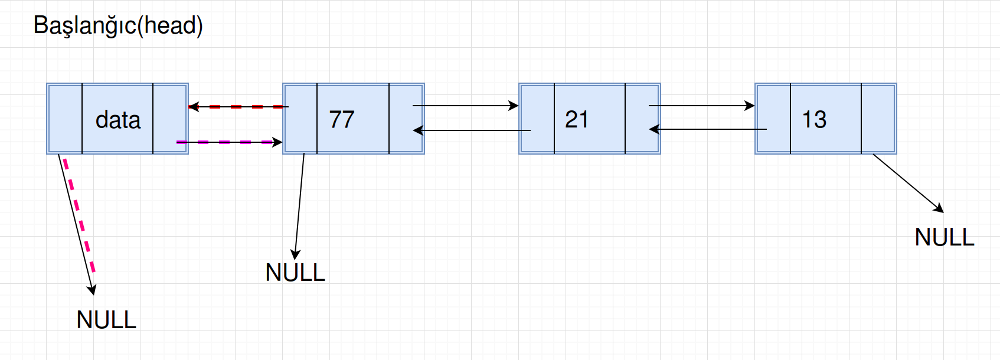

# İkitərəfli Əlaqəli listlər(doubly linked lists)

Bu fəsildə Əlaqəli listlərin bir növü olan İkitərəfli Əlaqəli listlərdən danışacağıq.

İkitərəfli əlaqəli listin əsas üstünlüyü odur ki, biz verilmiş node-la həm arxaya, həm də önə hərəkət edə bilirik.
Adından da göründüyü kimi bu listin node-u bizə ikitərəfli hərəkət bəxş edir.

Ikitərəfli əlaqəli listin zəif cəhətləri:
* Hər node əlavə bir pointeri saxlamaq üçün də yaddaş tələb edir.
* Daxil etmə və silmə əməliyyatları əlavə pointer olduğu üçün daha çox vaxt aparır.

Birtərəfli əlaqəli listdə olduğu kimi, burda da, gəlin istifadəçi tipini təyin edək(user defined type).
Aşağıdakı kod, ikitərəfli əlaqəli list üçün tip deklarasiyasıdır(elanıdır):

> Bütün kodlara baxmaq üçün keçid: [fesil4_doubly_linked_lists.py](../Source_Code/python_kodlar/fesil4/fesil4_doubly_linked_lists.py)

```
class Node:
    # Konstruktor
    # Əgər istifadəçi tərəfindən heçnə verilmirsə, bu zaman None(NULL) olaraq inisializasiya edirik
    def __init__(self, data=None, next_node=None, prev_node=None):
        self.data = data
        self.next_node = next_node
        self.prev_node = prev_node

    # node-un data field-ini mənimsətmək  üçün metod
    def set_data(self, data):
        self.data = data

    # node-un data field-ini almaq üçün metod
    def get_data(self):
        return self.data

    # node-un növbəti(next) field-ini mənimsətmək üçün metod
    def set_next_node(self, next_node):
        self.next_node = next_node

    # node-un növbəti(next) field-ini almaq üçün metod
    def get_next_node(self):
        return self.next_node

    # əgər bir node sonrakına point edirsə, True qaytar
    def has_next(self):
        return self.next_node is not None

    # node-un əvvəlki(previous) field-ini mənimsətmək üçün metod
    def set_prev_node(self, prev_node):
        self.prev_node = prev_node

    # node-un əvvəlki(previous) field-ini almaq üçün metod
    def get_prev_node(self, prev_node):
        return self.prev_node

    # node-dan əvvəlki varsa, True
    def has_prev(self):
        return self.prev_node is not None
```

**İkitərəfli Əlaqəli listdə daxil etmə əməliyyatı**
İkitərəfli Əlaqəli listdə daxil etmənın 3 halı vardır(birtərəfli əlaqəli listdə olduğu kimi):
* Yeni node-u head-dən əvvələ daxil etmək(listin əvvəlinə).
* Yeni node-u tail-dən sonraya daxil etmək(listin sonuna).
* Yeni node-u listin ortasına daxil etmək.

**İkitərəfli Əlaqəli listin əvvəlinə node daxil etmək**
Bu halda, yeni node head-dən əvvələ daxil olunur. Bu zaman, əvvəlki və növbəti göstəriciləri yenilənməlidir. Bu əməliyyatı aşağıdakı 2 addımla icra edə bilərik:

* Yeni node-un növbəti(next) pointerini hal-hazırkı head node-a yönləndiririk. Əvvəlki(previous) pointerini isə NULL-a yönləndiririk.


* Hal-hazırkı head node-un əvvəlki pointerini yeni node-a yönləndiririk. Yəni, faktiki olaraq, yeni node-u head node edirik.



Kod nümnunəmiz:

```
class DoublyLinkedList:

    def __init__(self, head=None, tail=None):
        self.head = head
        self.tail = tail

    def insert_at_beginning(data):
        new_node = Node(data)

        if self.head is None:
            self.head = new_node
            self.tail = new_node
        else:
            new_node.set_prev_node(None)
            new_node.set_next_node(self.head)
            self.head.set_prev_node(new_node)
            self.head = new_node
```

Kodumuzu test edirik:

```
(Pdb) obj = DoublyLinkedList()
(Pdb) obj.insert_at_beginning(11)
(Pdb) obj.insert_at_beginning(55)
(Pdb) obj.insert_at_beginning(3)
```

Vizual olaraq, yuxarıdakı kodun icrasından sonra bizim əlimizdə aşağıdakı şəkildəki kimi, İkitərəfli Əlaqəli list olacaq:


