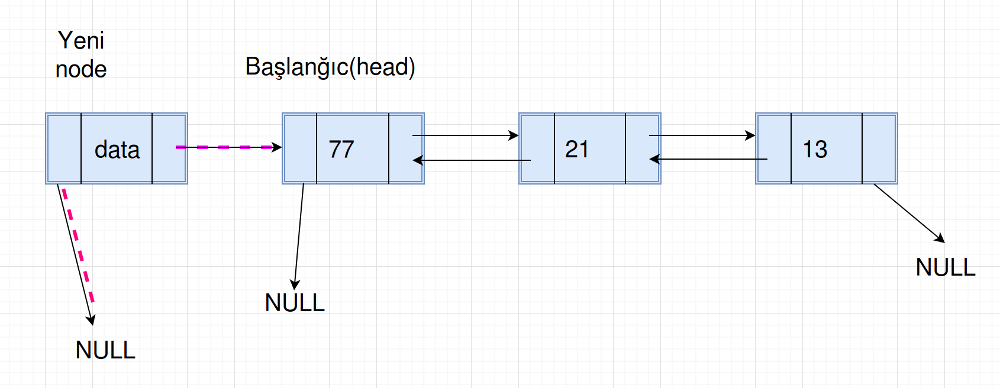
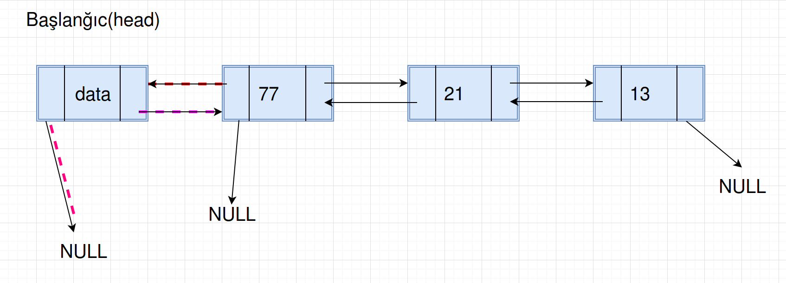
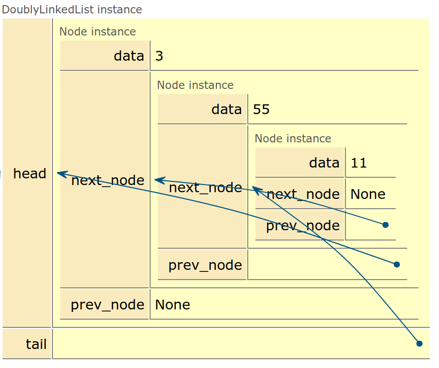
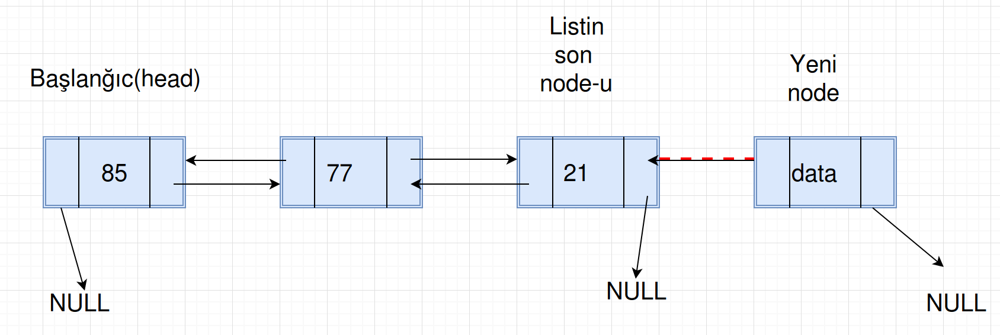
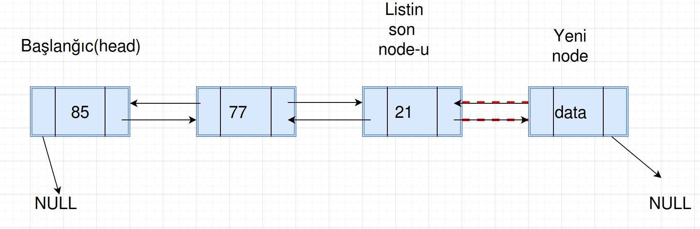
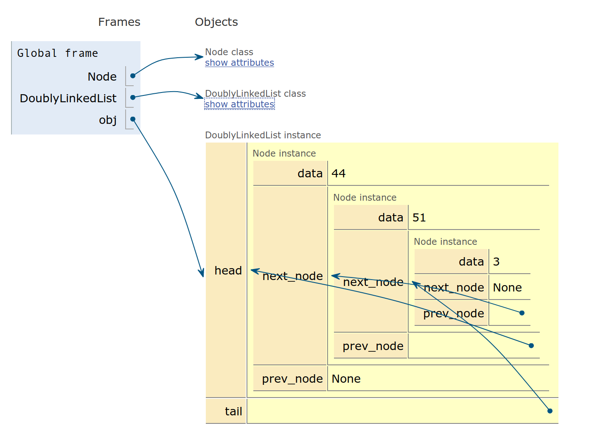
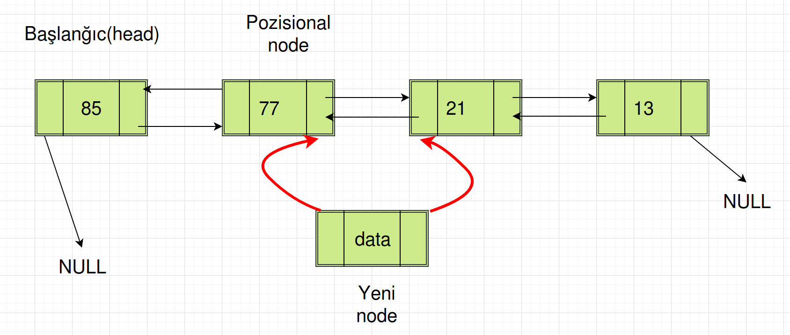
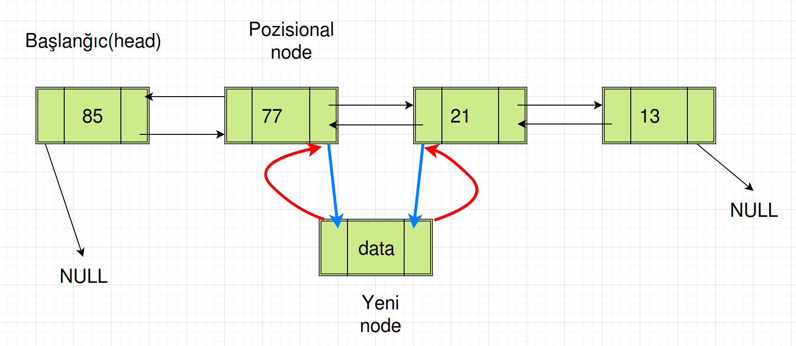
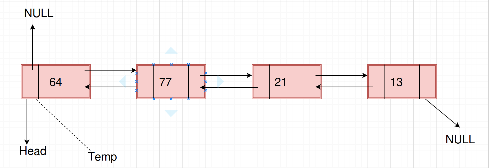
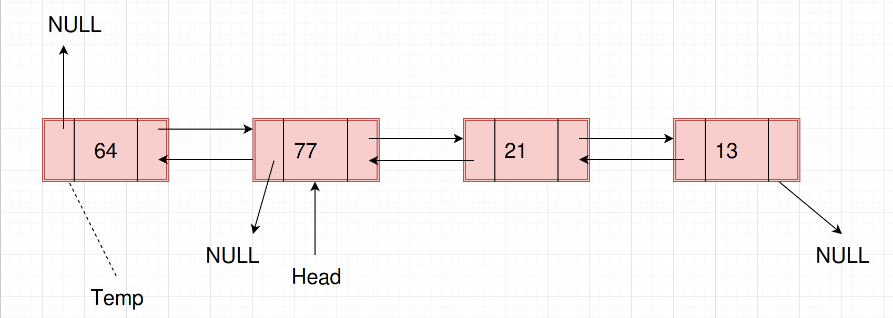

# İkitərəfli Əlaqəli listlər(doubly linked lists)

Bu fəsildə Əlaqəli listlərin bir növü olan İkitərəfli Əlaqəli listlərdən danışacağıq.

İkitərəfli əlaqəli listin əsas üstünlüyü odur ki, biz verilmiş node-la həm arxaya, həm də önə hərəkət edə bilirik.
Adından da göründüyü kimi bu listin node-u bizə ikitərəfli hərəkət bəxş edir.

Ikitərəfli əlaqəli listin zəif cəhətləri:
* Hər node əlavə bir pointeri saxlamaq üçün də yaddaş tələb edir.
* Daxil etmə və silmə əməliyyatları əlavə pointer olduğu üçün daha çox vaxt aparır.

Birtərəfli əlaqəli listdə olduğu kimi, burda da, gəlin istifadəçi tipini təyin edək(user defined type).
Aşağıdakı kod, ikitərəfli əlaqəli list üçün tip deklarasiyasıdır(elanıdır):

> Bütün kodlara baxmaq üçün keçid: [fesil4_doubly_linked_lists.py](../Source_Code/python_kodlar/fesil4/fesil4_doubly_linked_lists.py)

```
class Node:
    # Konstruktor
    # Əgər istifadəçi tərəfindən heçnə verilmirsə, bu zaman None(NULL) olaraq inisializasiya edirik
    def __init__(self, data=None, next_node=None, prev_node=None):
        self.data = data
        self.next_node = next_node
        self.prev_node = prev_node

    # node-un data field-ini mənimsətmək  üçün metod
    def set_data(self, data):
        self.data = data

    # node-un data field-ini almaq üçün metod
    def get_data(self):
        return self.data

    # node-un növbəti(next) field-ini mənimsətmək üçün metod
    def set_next_node(self, next_node):
        self.next_node = next_node

    # node-un növbəti(next) field-ini almaq üçün metod
    def get_next_node(self):
        return self.next_node

    # əgər bir node sonrakına point edirsə, True qaytar
    def has_next(self):
        return self.next_node is not None

    # node-un əvvəlki(previous) field-ini mənimsətmək üçün metod
    def set_prev_node(self, prev_node):
        self.prev_node = prev_node

    # node-un əvvəlki(previous) field-ini almaq üçün metod
    def get_prev_node(self, prev_node):
        return self.prev_node

    # node-dan əvvəlki varsa, True
    def has_prev(self):
        return self.prev_node is not None
```
```
// Java kod
public class Node {

    private int data;
    private Node next_node;
    private Node prev_node;

    // Konstruktor
    public Node(int data, Node next_node, Node prev_node) {
        this.data      = data;
        this.next_node = next_node;
        this.prev_node = prev_node;
    }

    public Node() {
    }

    // node-un data field-ini mənimsətmək  üçün metod
    public void set_data(int data) {
        this.data = data;
    }

    // node-un data field-ini almaq üçün metod
    public int get_data() {
        return data;
    }

    // node-un növbəti(next) field-ini mənimsətmək üçün metod
    public void set_next_node(Node next_node){
        this.next_node = next_node;
    }

    // node-un növbəti(next) field-ini almaq üçün metod
    public Node get_next_node() {
        return next_node;
    }

    // əgər bir node sonrakına point edirsə, True qaytar
    public boolean has_next() {
        if(next_node != null) return true;
        else                  return false;
    }

    // node-un əvvəlki(previous) field-ini mənimsətmək üçün metod
    public void set_prev_node(Node prev_node){
        this.prev_node = prev_node;
    }

    // node-un əvvəlki(previous) field-ini almaq üçün metod
    public Node get_prev_node(){
        return prev_node;
    }

    // node-dan əvvəlki varsa, True
    public boolean has_prev(){
        if(prev_node != null) return true;
        else                  return false;
    }
}

```
**İkitərəfli Əlaqəli listdə daxil etmə əməliyyatı**
İkitərəfli Əlaqəli listdə daxil etmənın 3 halı vardır(birtərəfli əlaqəli listdə olduğu kimi):
* Yeni node-u head-dən əvvələ daxil etmək(listin əvvəlinə).
* Yeni node-u tail-dən sonraya daxil etmək(listin sonuna).
* Yeni node-u listin ortasına daxil etmək.

**İkitərəfli Əlaqəli listin əvvəlinə node daxil etmək**
Bu halda, yeni node head-dən əvvələ daxil olunur. Bu zaman, əvvəlki və növbəti göstəriciləri yenilənməlidir. Bu əməliyyatı aşağıdakı 2 addımla icra edə bilərik:

* Yeni node-un növbəti(next) pointerini hal-hazırkı head node-a yönləndiririk. Əvvəlki(previous) pointerini isə NULL-a yönləndiririk.



* Hal-hazırkı head node-un əvvəlki pointerini yeni node-a yönləndiririk. Yəni, faktiki olaraq, yeni node-u head node edirik.



Kod nümunəmiz:

```
class DoublyLinkedList:

    def __init__(self, head=None, tail=None):
        self.head = head
        self.tail = tail

    def insert_at_beginning(data):
        new_node = Node(data)

        if self.head is None:
            self.head = new_node
            self.tail = new_node
        else:
            new_node.set_prev_node(None)
            new_node.set_next_node(self.head)
            self.head.set_prev_node(new_node)
            self.head = new_node
```
```
// Java kod
public class DoublyLinkedList {

    private Node head;
    private Node tail;

    public DoublyLinkedList() {
    }

    public DoublyLinkedList(Node head, Node tail) {
        this.head = head;
        this.tail = tail;
    }

    public void insert_at_beginning(int data){
        Node new_node = new Node(data, null, null);
        //new_node.set_data(data);

        if(head == null){
            head = new_node;
            tail = new_node;
        }else{
            new_node.set_prev_node(null);
            new_node.set_next_node(head);
            head.set_prev_node(new_node);
            head = new_node;
        }
    }
}

```
Kodumuzu test edirik:

```
(Pdb) obj = DoublyLinkedList()
(Pdb) obj.insert_at_beginning(11)
(Pdb) obj.insert_at_beginning(55)
(Pdb) obj.insert_at_beginning(3)
```
```
// Java kod
public static void main(String[] args) {
        DoublyLinkedList dll = new DoublyLinkedList(null, null);
        dll.insert_at_beginning(11);
        dll.insert_at_beginning(55);
        dll.insert_at_beginning(3);
}
```

Vizual olaraq, yuxarıdakı kodun icrasından sonra bizim əlimizdə aşağıdakı şəkildəki kimi, İkitərəfli Əlaqəli list olacaq:




**İkitərəfli Əlaqəli listin sonuna node daxil etmək**

Bu halda listin sonuna getmək və node-u sona daxil etmək lazımdır.

* Yeni node-un sağ(sonrakı, next) pointeri NULL-a, sol(previous) pointeri isə listin sonundakı node-a çevrilir, yönləndirilir.



* Listin son node-unun sağ pointerini yeni node-a yönləndiririk. Beləcə, faktiki olaraq yeni node bizim son node-umuz olur.



Nümunə koda nəzər yetirək:

```
def insert_at_end(self, data):
      new_node = Node(data, next_node=None, prev_node=None)

      if self.head is None:
          self.head = new_node
          self.tail = self.head
      else:
          current = self.head
          # Sonuncu node-u tapırıq
          while current.get_next_node() is not None:
              current = current.get_next_node()
          # Hal-hazırkı sonuncu node üçün next pointeri yeni node edirik.    
          current.set_next_node(new_node)
          # Yeni node-un əvvəlki pointerini hal-hazırkı(while-da tapılan) node edirik.
          new_node.set_prev_node(current)
          # Yeni node-un next pointerini NULL-a yönləndiririk.
          new_node.set_next_node(None)

          self.tail = new_node
```
```
// Java kod
public void insert_at_end(int data){
        Node new_node = new Node(data, null, null);
        
        if(head == null){
            head = new_node;
            tail = head;
        }else{
            Node current = head;
            //Sonuncu node-u tapırıq
            while(current.get_next_node() != null){
                current = current.get_next_node();
            }
            
            //Hal-hazırkı sonuncu node üçün next pointeri yeni node edirik. 
            current.set_next_node(new_node);
            //Yeni node-un əvvəlki pointerini hal-hazırkı(while-da tapılan) node edirik.
            new_node.set_prev_node(current);
            //Yeni node-un next pointerini NULL-a yönləndiririk.
            new_node.set_next_node(null);
            
            tail = new_node;
        }
    }
```
Kodumuzu test edək:

```
(Pdb) obj = DoublyLinkedList()
(Pdb) obj.insert_at_end(44)
(Pdb) obj.insert_at_end(51)
(Pdb) obj.insert_at_end(3)
```
```
public static void main(String[] args){
    DoublyLinkedList dll = new DoublyLinkedList();
    dll.insert_at_end(44);
    dll.insert_at_end(51);
    dll.insert_at_end(3);
}
```
Nəticənin vizual görüntüsü:



**İkitərəfli əlaqəli listin ortasına node daxil etmək**
Birtərəfli əlaqəli listdə olduğu kimi, verilmiş pozisiyaya qədər listi qətt etmək lazımdır və həmin pozisiyaya node-u daxil etmək lazımdır.
> Daxil etmək istədiyimiz node - yeni node.
> Daxil etmək istədiyimiz yer - pozisional node.

Bildiyimiz kimi, ikitərəfli əlaqəli listdə, sağ və sol istiqamətə pointerlər var. Bundan yola çıxsaq, ikitərəli əlaqəli list-də verilmiş pozisiyaya node daxil etmək aşağıdakı addımlardan ibarətdir:

* Yeni node-un sağ(next) pointer-i pozisional node-un next pointer-inin göstərdiyi node-a(next node) yönlənir. Həmçinin, yeni node-un sol(previous) pointeri pozisional node-un özünə yönlənir. Bununla da sanki, biz yeni node-u artıq listin verilmiş pozisiyasına salmış oluruq.




* Bundan sonra, pozisional node-un sağ pointerini bizim yeni node-a yönləndirmək lazımdır. Bundan əlavə, pozisional node-un next node-unun sol pointerini yeni node-a yönləndiririk.




Nümunə kodumuza və kod daxilindəki kommentlərə diqqət edək:

```
def list_size(self):
      current = self.head
      count = 0
      while current:
          count += 1
          current = current.get_next_node()
      return count

  def insert_at_pos(self, pos, data):
      if pos > self.list_size() or pos < 0:
          print("Pozisiya səhvdir, None qaytarıram..")
          return None
      else:
          # Əgər pozisiya 0 verilibsə və yaxud head node None-dırsa, əvvələ daxil et.
          if pos == 0 or self.head is None:
              print("Əvvələ daxil etmə...")
              self.insert_at_beginning(data)
          elif pos == self.list_size():
              print("Ən sona daxil etmə...")
              self.insert_at_end(data)
          elif pos > 0:
              print("Verilmiş pozisiyaya daxil etmə...")
              new_node = Node()
              new_node.set_data(data)

              count = 0
              current = self.head
              # Verilmiş pozisiyadan bir əvvəlki node-u tapırıq, yəni pozisional node-u
              while count < (pos - 1):
                  count += 1
                  current = current.get_next_node()
              # Pozisional node-dan(hal-hazırkı node) sonrakı node-un previous pointerini new_node-a yönləndiririk.
              current.get_next_node().set_prev_node(new_node)
              # Pozisional node-un next pointerini new_node-a yönləndiririk.
              current.set_next_node(new_node)    
              # Yeni node-un next pointerini, pozisional node-dan növbəti node-a yönləndiririk.
              new_node.set_next_node(current.get_next_node())
              # Yeni node-un əvvəlki pointerini, hal-hazırkı node-a yönləndiririk.
              new_node.set_prev_node(current)
```
```
//Java kod
 public int list_size(){
        Node current = head;
        int count    = 0;
        while(current != null){
            count  += 1;
            current = current.get_next_node();
        }
        return count;
    }
    
    public void insert_at_post(int pos, int data){
        if(pos > list_size() || pos < 0) throw new IndexOutOfBoundsException("Pozisiya səhvdir, None qaytarıram..");
        else if(pos == 0 || head == null){
            System.out.println("Əvvələ daxil etmə...");
            insert_at_beginning(data);
        }else if(pos == list_size()){
            System.out.println("Əvvələ sona etmə...");
            insert_at_end(data);
        }else{
            System.out.println("Verilmiş pozisiyaya daxil etmə...");
            Node new_node = new Node();
            new_node.set_data(data);
            
            int count = 0;
            
            Node current = head;
            
            //Verilmiş pozisiyadan bir əvvəlki node-u tapırıq, yəni pozisional node-u
            while(count < (pos-1)){
                count++;
                current = current.get_next_node();
            }
            //Pozisional node-dan(hal-hazırkı node) sonrakı node-un previous pointerini new_node-a yönləndiririk.
            current.get_next_node().set_prev_node(new_node);
            //Pozisional node-un next pointerini new_node-a yönləndiririk.
            new_node.set_next_node(current.get_next_node());
            current.set_next_node(new_node);
            //Yeni node-un next pointerini, pozisional node-dan növbəti node-a yönləndiririk.
            
            //Yeni node-un əvvəlki pointerini, hal-hazırkı node-a yönləndiririk.
            new_node.set_prev_node(current);
        }
    }
```
*Vaxt mürəkkəbliyi: O(n), Çünki, ən pis halda, listin sonuna node daxil edirik.*

*Yer(space) mürəkkəbliyi: O(1), əlavə count dəyişənini yaradıb artırdığı üçün(sabit vaxt ərzində)*

Kodumuzu test edək:

```
# obyektin yaradılması
(Pdb) obj = DoublyLinkedList()
# 0-cı pozisiyaya daxil etmə
(Pdb) obj.insert_at_pos(pos=0, data=44)
Əvvələ daxil etmə...
# 1-ci pozisiyaya daxil etmə. Faktiki olaraq bizim listdə cəmi 1 element var odur ki, bu ən sona daxil etmə deməkdir.
(Pdb) obj.insert_at_pos(pos=1, data=3)
Ən sona daxil etmə...
# 1-ci pozisiyaya daxil etmə. Bu zaman artıq bizim listdə 2 element var.
(Pdb) obj.insert_at_pos(pos=1, data=6)
Verilmiş pozisiyaya daxil etmə...
(Pdb) obj.list_size()
3
```
```
public static void main(String[] args){
    //obyektin yaradılması
    DoublyLinkedList dll = new DoublyLinkedList();
    // 0-cı pozisiyaya daxil etmə
    dll.insert_at_pos(0, data=44); //Əvvələ daxil etmə...
    //1-ci pozisiyaya daxil etmə. Faktiki olaraq bizim listdə cəmi 1 element var odur ki, bu ən sona daxil etmə deməkdir.
    dll.insert_at_pos(1, ;3) //Ən sona daxil etmə...
    //1-ci pozisiyaya daxil etmə. Bu zaman artıq bizim listdə 2 element var.
    dll.insert_at_pos(1,6); // Verilmiş pozisiyaya daxil etmə...
    dll.list_size(); //3
}
```
**İkitərəfli əlaqəli listdən silmə əməliyyatı**
Birtərəfli əlaqəli listdə olduğu kimi, indi də bizim 3 əməliyyatımız var:
* Birinci node-un silinməsi
* Sonuncu node-un silinməsi
* Verilmiş pozisiyada node-un silinməsi

**İkitərəfli əlaqəli listdən birinci node-un silinməsi**
Bu halda birinci node listdən silinir və bu iki addımla yerinə yetirilə bilər:
* Müvəqqəti bir node yaradırıq. Bu node ilk(head) node-la eyni olacaq(yəni eyni yerə point edir)



* İndi isə head node-un pointerini next node-a yönəldirik, yəni növbəti node-u faktiki olaraq ilk node edirik və onun sol(previous) node-unu NULL(None)-a yönəldirik. Daha sonra, müvəqqəti node-u silirik.



Nümunə kodumuza baxaq:

```
def delete_first_node(self):
      if self.list_size() == 0:
          print("List boşdur...")
      else:
          # Müvəqqəti node
          temp = self.head
          # Head node-u əvvəlki head-dən sonrakı node-a mənimsədirik.
          # Bununla da faktiki olaraq, əvvəlki head-i arxada qoyuruq.
          self.head = self.head.get_next_node()
          # Yeni head və yaxud yeni node-umuzun sol(previous) node-a pointeri None edirik.
          self.head.set_prev_node(None)
          # Müvəqqəti node-u silirik.
          del(temp)
```

Kodumuzu test edək:

```
(Pdb) obj = DoublyLinkedList()
(Pdb) obj.insert_at_beginning(12)
(Pdb) obj.insert_at_beginning(44)
(Pdb) obj.insert_at_beginning(88)
(Pdb) obj.list_size()
3
(Pdb) obj.delete_first_node()
(Pdb) obj.list_size()
2
(Pdb) obj.delete_first_node()
(Pdb) obj.list_size()
1
```

**İkitərəfli əlaqəli listdən sonuncu node-un silinməsi**
Bu zaman ən sona qədər listi qətt etməli, sonuncu node-u tapmaq lazımdır.
Daha sonra sonuncu node-dan bir əvvəlki node-u aşkarlamaq lazımdır.
Sonuncudan bir əvvəlki node aşkarladıqdan sonra isə, onun next pointer-ini NULL-a yönləndiririk. Beləliklə, faktiki olaraq sonuncu node-u itiririk.

Kod nümunəmizdə bu daha da aydın olacaq:

```
def delete_last_node(self):
      if self.list_size() == 0:
          print("List boşdur...")
      else:
          # Head node-dan başlayırıq
          current_node = self.head
          # Sonuncu  node-u aşkarlayırıq
          while current_node.get_next_node() is not None:
              current_node = current_node.get_next_node()
          # Sonuncu node-dan bir əvvəlki node-u tapırıq
          previous_node = current_node.get_prev_node()
          # Bir əvvəlki node-un növbəti
          previous_node.set_next_node(None)
          # current node-u silirik
          del(current_node)   
```

Yazdığımız metodların(funksiyaların) düzgün işlədiyini sübut etmək üçün traverse_and_print() adlı yeni metod yazaq.
Sadəcə əvvəldən axıra kimi listi qətt edək və hər node-un data-sını print edək:

```
def traverse_and_print(self):
      if self.list_size() == 0:
          print("List boşdur...")
      else:
          # Head node-dan başlayırıq
          current_node = self.head
          while current_node.get_next_node() is not None:
              current_node = current_node.get_next_node()
              print(current_node.get_data())
```

İndi isə kodumuzu test edək:

```
(Pdb) obj = DoublyLinkedList()
(Pdb) obj.insert_at_beginning(44)
(Pdb) obj.insert_at_beginning(12)
(Pdb) obj.insert_at_beginning(99)
(Pdb) obj.insert_at_pos(2, 51)
Verilmiş pozisiyaya daxil etmə...
(Pdb) obj.insert_at_end(101)
(Pdb) obj.traverse_and_print()
99
12
51
44
101
```

Buna əsasən, deyə bilərik ki, sonuncu node-u silsək artıq bizim listin yeni son node-u 44 olacaq:
```
(Pdb) obj.delete_last_node()
(Pdb) obj.traverse_and_print()
99
12
51
44
```

Nəticə doğrudur.

**İkitərəfli əlaqəli listdən aralıq node-un silinməsi**
Bu halda, bir şeyi yadda saxlamaq lazımdır ki, axtarılan node(silmək istədiyimiz node), həmişə 2 node-un arasında yerləşir.
Axtardığımız, verilmiş node-u silmək üçün aşağıdakı addımları icra edirik:

* Məntiqən bu addım verilmiş pozisiyadakı,yaxud verilmiş data-sı olan node-u tapmaqla başlayır. İkitərəfli əlaqəli listdə, həm sağa, həm də sola pointer olduğu üçün verilmiş node-u silmək elə də çətin deyil. Bu məqsədlə silinməli olan node-dan solda qalan(previous) node-un növbəti(next) pointer-ini silinməli olan node-dan sağda qalan node-a yönləndirmək lazımdır. Daha sonra da, silinməli olan node-dan sağda qalan(next) node-un əvvəlki(previous) pointerini, silinməli olan node-dan solda qalana yönləndirmək lazımdır. Bu addımlardan sonra sanki verilmiş node ortada, havada qalır.

* Verilmiş node-u silirik(Zibil yığan bu işi görür).

Gəlin kod nümunəmizə nəzər yetirək. İlk öncə verilmiş data-ya əsasən node-u silək:

```
def delete_from_list_by_data(self, data):
      # Burada, current, tapılan node-u, data-ya əsasən silirik.
      current_node = self.head
      found = False

      # current_node None olsa dayan, found True olsa dayan
      while current_node and found is False:
          if current_node.get_data() == data:
              found = True
          else:
              current_node = current_node.get_next_node()

      if current_node is None:
          # Fərqlilik məqsədilə Exception-dan istifadə edirik
          raise ValueError("Data listdə tapılmadı...")
      if current_node.get_prev_node() is None:
          # Bu o deməkdir ki, axtarılan data elə 1ci(head) node-da tapılıb.
          # Bu zaman head-i sadəcə növbəti node-a işarəliyirik.
          # Əslində bu hal, list-in əvvəlindən node silməyə bərabərdir.
          self.head = current_node.get_next_node()
      else:
          # Əvvəlki node-un next pointerini, hal-hazırkı(current) node-un next node-una yönləndiririk.
          current_previous_node = current_node.get_prev_node()
          current_previous_node.set_next_node(current_node.get_next_node())
          # Sonrakı node-un əvvəlki pointerini isə hal-hazırkı(current) node-un əvvəlki node-una yönləndiririk.
          current_next_node = current_node.get_next_node()
          current_next_node.set_prev_node(current_node.get_prev_node())
```

Kodu test edirik:

```
(Pdb) obj = DoublyLinkedList()
(Pdb) obj.insert_at_beginning(44)
(Pdb) obj.insert_at_beginning(12)
(Pdb) obj.insert_at_beginning(99)
(Pdb) obj.insert_at_pos(2, 51)
Verilmiş pozisiyaya daxil etmə...
(Pdb) obj.insert_at_end(101)
(Pdb) obj.traverse_and_print()
99
12
51
44
101
(Pdb) obj.delete_from_list_by_data(44)
(Pdb) obj.traverse_and_print()
99
12
51
101
```

Göründüyü kimi, 44 data-lı node silindi.

İndi isə verilmiş pozisiyaya əsasən node-un silinməsinə baxaq.
Nümunə kodumuz:

```
def delete_at_position(self, pos):
      count = 0
      current_node = self.head

      if pos > self.list_size() or pos < 0:
          print("Pozisiya səhvdir, None qaytarıram..")
          return None
      elif pos == 0:
          # Bu o deməkdir ki, listin əvvəlindən node silirik.
          self.delete_first_node()
      elif pos == self.list_size():
          # Bu o deməkdir ki, listin sonundan node silirik.
          self.delete_last_node()
      else:
          # Əgər listin axırına çatmamışıqsa və count verilmiş pozisiyadan kiçikdirsə, davam elə
          while (current_node.get_next_node() is not None) or count < pos:
                  count = count + 1
                  if count == pos:
                      # Əgər verilmiş pozisiyaya çatdıqsa, əvvəlki node-un next pointer-ini, indiki node-un next pointerinə yönləndiririk.
                      current_previous_node = current_node.get_prev_node()
                      current_previous_node.set_next_node(current_node.get_next_node())

                      # Sonrakı node-un əvvəlki pointerini isə hal-hazırkı(current) node-un əvvəlki node-una yönləndiririk.
                      current_next_node = current_node.get_next_node()
                      current_next_node.set_prev_node(current_node.get_prev_node())
                      return
                  else:
                      # Əgər hələ pozisiyaya çatmamışıqsa, o zaman davam edirik.
                      current_node = current_node.get_next_node()
```

*Vaxt mürəkkəbliyi: O(n), n ölçülü listi qətt etdiyi üçün*

*Yer(space) mürəkkəbliyi: O(1), əlavə count dəyişənini yaradıb artırdığı üçün(sabit vaxt ərzində)*

Kodumuzu test edirik:

```
(Pdb) obj = DoublyLinkedList()
(Pdb) obj.insert_at_beginning(44)
(Pdb) obj.insert_at_beginning(12)
(Pdb) obj.insert_at_beginning(99)
(Pdb) obj.insert_at_pos(2, 51)
Verilmiş pozisiyaya daxil etmə...
(Pdb) obj.insert_at_end(101)
(Pdb) obj.traverse_and_print()
99
12
51
44
101
(Pdb) obj.delete_at_position(3)
(Pdb) obj.traverse_and_print()
99
12
44
101
```

İstədiyimiz nəticəni əldə etdik.

Hörmətli oxucu, bununla da İkitərəfli əlaqəli listlər mövzusunu başa vururuq.
Növbəti fəsildə, Dövri listlərdən danışacağıq.
