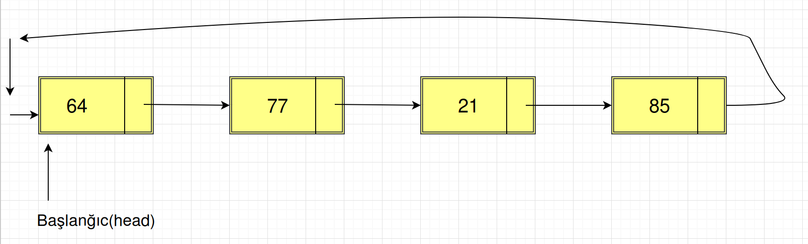

# Dövri Əlaqəli listlər(circular linked lists)

Birtərəfli və İkitərəfli əlaqəli listlərdə, listin sonu NULL(None)-la bitirdi. Dövri əlaqəli listin isə sonu yoxdu.
Dolayısı ilə, dövri əlaqəli listi başdan ayağa qətt edərkən ehtiyatlı olmalıyıq. Əks təqdirdə, bu qətt etmə əməliyyatı heç vaxt sonlanmayacaq. Dövri əlaqəli listdə hər node-un özündən sonra bir node var. Yuxarıda da deyildiyi kimi, burda, NULL pointer-li node yoxdur. Bəzi hallarda, dövri əlaqəli listlər faydalı ola bilər. Əslində, tip deklarasiyasında, dövri və birtərəfli listlər arasında fərq yoxdur.

Aşağıdakı kod, Dövri Əlaqəli list üçün tip elanıdır(declaration):

```
class Node:
    # konstruktor
    def __init__(self, data=None, next_node=None):
        self.data = data
        self.next_node = next_node

    # node-un data field-ini mənimsətmək  üçün metod
    def set_data(self, data):
        self.data = data

    # node-un data field-ini almaq üçün metod
    def get_data(self):
        return self.data

    # node-un növbəti field-ini mənimsətmək üçün metod
    def set_next_node(self, next_node):
        self.next_node = next_node

    # node-un növbəti field-ini almaq üçün metod
    def get_next_node(self):
        return self.next_node

    # əgər bir node sonrakına point edirsə, true qaytar
    def has_next(self):
        return self.next_node is not None
```

> QEYD: Dövri əlaqəli listdə də biz elementlərə head node vasitəsilə çatırıq.

**Dövri əlaqəli listdə node sayının hesablanması**

Dövri əlaqəli list-in elementlərinə head node vasitəsilə çatırıq. Burda incə məqam odur ki, biz dövri listə əvvəldən axıra qətt etmək istəyiriksə, head node-dan başlayıb elə head node-da da dayanmalıyıq. Çünki, bizdə listin sonunu göstərən NULL-a yönəldilən node yoxdur.
Təbii ki, əgər list boşdursa, o zaman head node NULL olacaq və bu zaman count-u 0-a bərabər edirik.
Yox əgər list boş deyilsə, bu pointeri birinci node-a qoyuruq və list boyu irəliləyirik, yenidən head node-u gördükdə isə dayanırıq. Çünki, artıq başladığımız nöqtəyə çatdıq.



Aşağıdakı kod nümunəmizə baxaq:

```
class CircularLinkedList:
    def __init__(self, head=None):
        self.head = head

    def circular_list_length(self):
        current_node = self.head

        if current_node == None:
            return 0

        count = 1
        current_node = current_node.get_next_node()
        # Dövri əlaqəli listdə yenidən head node-a gedib çıxmışıq ya yox, onu yoxlayırıq.
        while current_node != self.head:
            current_node = current_node.get_next_node()
            count = count + 1

        return count
```

**Dövri listin elementlərini göstərmək**

Eyni əməliyyatı burda da icra edirik. Sadəcə burda node-un data-sını print edirik.

```
def print_data_circular_list(self):
      current_node = self.head

      if current_node == None:
          return 0

      print(current_node.get_data())
      current_node = current_node.get_next_node()
      while current_node != self.head:
          current_node = current_node.get_next_node()
          print(current_node.get_data())
```
