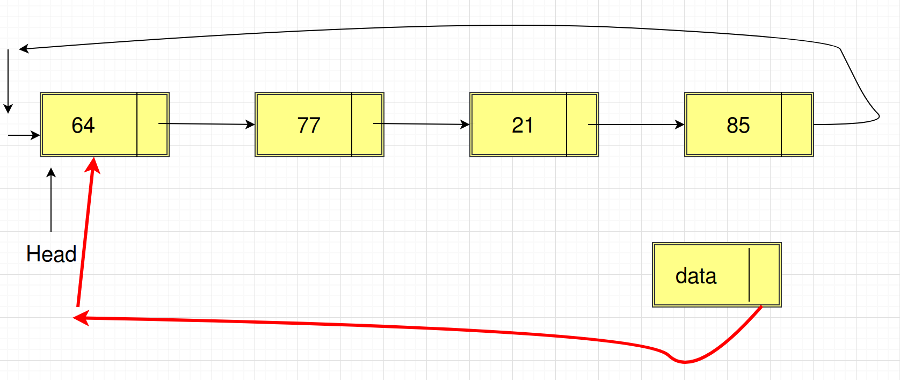

# Dövri Əlaqəli listlər(circular linked lists)

Birtərəfli və İkitərəfli əlaqəli listlərdə, listin sonu NULL(None)-la bitirdi. Dövri əlaqəli listin isə sonu yoxdur.
Dolayısı ilə, dövri əlaqəli listi başdan ayağa qət edərkən ehtiyatlı olmalıyıq. Əks təqdirdə, bu qət etmə əməliyyatı heç vaxt sonlanmayacaq. Dövri əlaqəli listdə hər node-un özündən sonra bir node var. Yuxarıda da deyildiyi kimi, burda, NULL pointer-li node yoxdur. Bəzi hallarda, dövri əlaqəli listlər faydalı ola bilər. Əslində, tip deklarasiyasında, dövri və birtərəfli listlər arasında fərq yoxdur.

Aşağıdakı kod, Dövri Əlaqəli list üçün tip elanıdır(declaration):

```python
class Node:
    # konstruktor
    def __init__(self, data=None, next_node=None):
        self.data = data
        self.next_node = next_node

    # node-un data field-ini mənimsətmək  üçün metod
    def set_data(self, data):
        self.data = data

    # node-un data field-ini almaq üçün metod
    def get_data(self):
        return self.data

    # node-un növbəti field-ini mənimsətmək üçün metod
    def set_next_node(self, next_node):
        self.next_node = next_node

    # node-un növbəti field-ini almaq üçün metod
    def get_next_node(self):
        return self.next_node

    # əgər bir node sonrakına point edirsə, true qaytar
    def has_next(self):
        return self.next_node is not None
```

> QEYD: Dövri əlaqəli listdə də biz elementlərə head node vasitəsilə çatırıq.

**Dövri əlaqəli listdə node sayının hesablanması**

Dövri əlaqəli list-in elementlərinə head node vasitəsilə çatırıq. Burda incə məqam odur ki, biz dövri əlaqəli listi əvvəldən axıra kimi qət etmək istəyiriksə, head node-dan başlayıb elə head node-da da dayanmalıyıq. Çünki, bizdə listin sonunu göstərən, NULL-a yönəldilən node yoxdur.
Təbii ki, əgər list boşdursa, o zaman head node NULL olacaq və bu zaman count-u 0-a bərabər edirik.
Yox əgər list boş deyilsə, bu pointeri birinci node-a qoyuruq və list boyu irəliləyirik, yenidən head node-u gördükdə isə dayanırıq. Çünki, artıq başladığımız nöqtəyə çatdıq.


Aşağıdakı kod nümunəmizə baxaq:

```python
class CircularLinkedList:
    def __init__(self, head=None):
        self.head = head

    def circular_list_length(self):
        current_node = self.head
        if current_node is None:
            return 0

        count = 1
        current_node = current_node.get_next_node()
        # Dövri əlaqəli listdə yenidən head node-a çatmağımızı yoxlayaq.
        while current_node != self.head:
            current_node = current_node.get_next_node()
            count = count + 1

        return count
```

**Dövri listin elementlərini göstərmək**

Eyni əməliyyatı burada da icra edirik. Sadəcə burada node-un data-sını print edirik.

```python

    def print_data_circular_list(self):
        current_node = self.head
        if current_node is None:
            return 0

        current_node = current_node.get_next_node()
        print(current_node.get_data())
        while current_node != self.head:
            current_node = current_node.get_next_node()
            print(current_node.get_data())
```

*Vaxt mürəkkəbliyi: O(n), n ölçülü listi qət etdiyi üçün*

*Yer(space) mürəkkəbliyi: O(1), əlavə dəyişən səbəbilə*

**Dövri əlaqəli listin sonuna node əlavə etmək**

Nəzərə alsaq ki, dövri əlaqəli listdə, listin sonunu göstərə biləcək NULL pointer yoxdur, bu zaman deyə bilərik ki, listin sonuna node əlavə etmək, onun hal-hazırda head-inə baxan node-la head-in arasına node daxil etmək deməkdir.
Bu məqsədlə aşağıdakı addımları etməliyik:

* Yeni node yaradırıq və müvəqqəti olaraq, həmin node-un növbəti pointerini özünə yönəldirik.


* Daha sonra, listi əvvəldən axıra qədər qət edərək, növbəti node-u head node olan, hal-hazırkı node-u tapırıq(faktiki olaraq, sonuncu node-u). Bundan sonra, biz yeni node-umuzu head node-a yönləndiririk.



* Ən sonda isə, keçmiş(əvvəlki) node-un növbəti(next) pointerini bizim indiki yeni node-umuza yönləndiririk.


Kod nümunəmiz aşağıdakı kimi olacaq:

```python
    def insert_at_end(self, data):
        current_node = self.head
        new_node = Node()
        new_node.set_data(data)

        if self.head is None:
            self.head = new_node
            new_node.set_next_node(self.head)
        else:
            current_node = current_node.get_next_node()
            while current_node.get_next_node() != self.head:
                current_node.get_next_node()
            # Yeni node-u özü-özünə point edirik.
            new_node.set_next_node(new_node)
            # Yeni node-u head node-a yönləndiririk.
            new_node.set_next_node(self.head)
            # Hal-hazırkı(faktiki olaraq əvvəlki) node-u isə yeni node-a yönləndiririk.
            current_node.set_next_node(new_node)
```

*Vaxt mürəkkəbliyi: O(n), n ölçülü listi qət etdiyi üçün*

*Yer(space) mürəkkəbliyi: O(1), əlavə dəyişən olması səbəbilə*

İndi isə kodumuzu test edək:

```python
obj = CircularLinkedList()
obj.insert_at_end(44)
obj.insert_at_end(3)
obj.insert_at_end(99)
print("Printing list length -> {}".format(obj.circular_list_length()))
obj.print_data_circular_list()
```

Bu dəfə faylımızı modul kimi icra edək, yəni PDB-dən istifadə etmədən:

```python
$ python3 fesil5_circular_linked_lists.py
Printing list length -> 3
3
99
44
```

Bizim dövri əlaqəli listimizin vizual görüntüsü:


**Dövri əlaqəli listin əvvəlinə node əlavə etmək**

Dövri əlaqəli listin əvvəlinə node əlavə etmək, onun sonuna node əlavə etməklə
oxşardır. Fərq bundadır ki, biz yeni node-u head node edirik.

Nümunə kodumuza baxaq:

```python
    def insert_at_beginning(self, data):
        current_node = self.head
        new_node = Node()
        new_node.set_data(data)
        # Yeni node-u özü-özünə point edirik.
        new_node.set_next_node(new_node)

        if self.head is None:
            self.head = new_node
            new_node.set_next_node(self.head)
        else:
            current_node.get_next_node()
            while current_node.get_next_node() != self.head:
                current_node = current_node.get_next_node()
            # Yeni node-u head node-a yönləndiririk.
            new_node.set_next_node(self.head)
            # Yeni node-u yeni head edirik
            self.head = new_node
            # Hal-hazırkı tapılan node-u isə yeni head-ə yönləndiririk və yaxud yeni node-a yönləndiririk.
            # current_node.set_next_node(new_node)
            current_node.set_next_node(self.head)
```

*Vaxt mürəkkəbliyi: O(n), n ölçülü listi qət etdiyi üçün*

*Yer(space) mürəkkəbliyi: O(1), əlavə dəyişən olması səbəbilə*

Kodumuzun nəticəsi:

```python
obj = CircularLinkedList()
obj.insert_at_end(44)
obj.insert_at_end(3)
obj.insert_at_end(99)
obj.insert_at_beginning(101)
obj.insert_at_beginning(6)
print("Printing list length -> {}".format(obj.circular_list_length()))
obj.print_data_circular_list()
```

```python
Printing list length -> 5
101
44
3
99
6
```

Yuxarıdakı əməliyyatlardan sonra bizim dövri əlaqəli listimizin vizual görüntüsü aşağıdakı kimidir:


**Dövri əlaqəli listdən sonuncu node-u silmək**

Xatırlayırıqsa, dövri əlaqəli listdə listin sonundakı elementdən sonrakı element listin başlanğıcı, head node-udur.
Dolayısı ilə sonuncu node-u silmək demək, əslində ondan əvvəlki node-u head node-a yönləndirmək deməkdir.
Bu zaman listi qət edərkən həm də əlavə bir dəyişəndən istifadə edib, hal-hazırkı node-dan əvvəlki node-u orda saxlamaq lazımdır.

Kod nümunəmizə diqqət etsək bu daha da aydın olacaq:

```python
    def delete_from_end(self):
        # Müvəqqəti dəyişən
        temp = self.head
        current_node = self.head

        if self.head is None:
            print("List boşdur...")
            return
        else:
            while current_node.get_next_node() != self.head:
                temp = current_node
                current_node = current_node.get_next_node()
            # Müvəqqəti node, əslində sondan bir əvvəlki node-dur.
            # Burada bu node-un növbəti pointer-ini faktiki olaraq head-ə yönləndiririk.
            temp.set_next_node(self.head)
            return
```

*Vaxt mürəkkəbliyi: O(n), n ölçülü listi qət etdiyi üçün*

*Yer(space) mürəkkəbliyi: O(1)*

Kodumuzu test edirik:

```python
obj = CircularLinkedList()
obj.insert_at_end(44)
obj.insert_at_end(3)
obj.insert_at_end(99)
obj.insert_at_beginning(101)
obj.insert_at_beginning(6)
print("Printing list length -> {}".format(obj.circular_list_length()))
obj.print_data_circular_list()
obj.delete_from_end()
print("Printing list length -> {}".format(obj.circular_list_length()))
obj.print_data_circular_list()
```

Burada gördüyümüz kimi, sonuncu node, data-sı 99 olandır və o da silindi.

```python
Printing list length -> 5
101
44
3
99
6
Printing list length -> 4
101
44
3
6
```

**Dövri əlaqəli listdən birinci node-un silinməsi**

Bu əməliyyat özü-özlüyündə, head node-un sürüşdürülməsidir. 
Lakin, bu zaman sonuncu node-un növbəti pointerini dəyişib, sürüşdürülmüş(yeni) head node-a yönləndirmək lazımdır.

Aşağıdakı sadə kodla bu aydın olacaq:

```python
    def delete_from_beginning(self):
        current_node = self.head

        if self.head is None:
            print("List boşdur...")
        else:
            # Sonuncu node-un tapılması
            while current_node.get_next_node() != self.head:
                current_node = current_node.get_next_node()
            # Sonuncu node-un pointerini hal-hazırkı head-den sonrakı node-a yönləndiririk.
            current_node.set_next_node(self.head.get_next_node())
            # Head node-u sürüşdürürük
            self.head = self.head.get_next_node()
```

Kodumuzu test edək:

```python
obj = CircularLinkedList()
obj.insert_at_end(44)
obj.insert_at_end(3)
obj.insert_at_end(99)
obj.insert_at_beginning(101)
obj.insert_at_beginning(6)
print("Printing list length -> {}".format(obj.circular_list_length()))
obj.print_data_circular_list()
obj.delete_from_end()
print("Printing list length -> {}".format(obj.circular_list_length()))
obj.print_data_circular_list()
obj.delete_from_beginning()
print("Printing list length -> {}".format(obj.circular_list_length()))
obj.print_data_circular_list()
```

Nəticəyə nəzər yetirsək görərik ki,ilk öncə listdən sonuncu olan 99 silinir, daha sonra da birinci olan 6:

```python
Printing list length -> 5
101
44
3
99
6
Printing list length -> 4
101
44
3
6
Printing list length -> 3
44
3
101
```

Nəticə doğrudur.

**Dövri əlaqəli listlərin istifadə yeri haqqında**

Dövri əlaqəli listi, kompüterin hesablama resurslarının idarəsində istifadə edə bilərik.
Stack və Queue yaratmaq üçün dövri əlaqəli listdən istifadə edə bilərik.

Hörmətli oxucu, bununla biz dövri əlaqəli listlər mövzusunu başa vurmuş oluruq.
