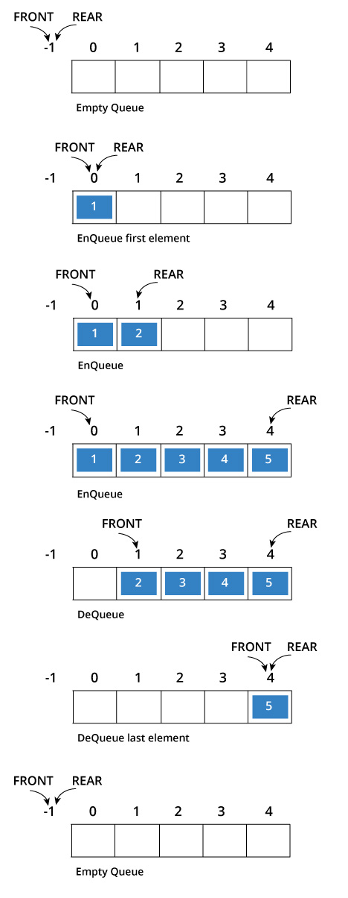
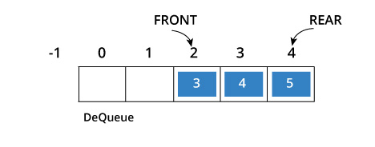
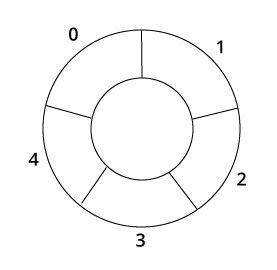
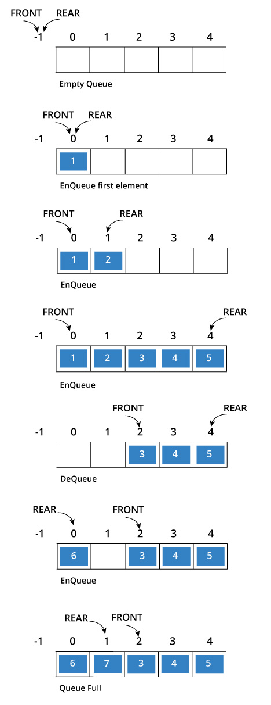

# Növbə(queue)

## 7.1 Növbə nədir?

Növbə də yığın kimi məlumatı saxlamaq üçün sadə data strukturudur.
Növbədə, datanın daxil olma ardıcıllığı önəmlidir.
Əslində, əsl həyatda növbədə gözləmək necədirsə, burda da elədir. Növbəyə ilk daxil olan, yəni növbədə birinci olan, xidmətdən də ilk istifadə edir.
Avtobusa birinci minir, bankda kassada manatını dollara birinci çevirir, dükanda dolu səbətini kassada ilk boşaldaraq, digər növbədəkilərin həsrət dolu baxışlarına tuş gəlir.

**Tərif**

Növbə elementlərin daxil olma ardıcıllığını saxlayan bir listdir. Bu listə element onun sonuna(rear) daxil edilir və onun əvvəlindən(front) silinir.
Dolayısı ilə, növbəyə ilk daxil edilən element, ilk də silinəcək(növbədən çıxacaq).
Buna həm də FİFO(First İn First Out) deyilir.

**Xüsusi terminlər**

Yığında olduğu kimi, bəzi xüsusi terminləri də burda qeyd etməliyik.
Elementin növbəyə daxil edilməsinə *EnQueue*, elementin növbədən silinməsinə isə *DeQueue* deyilir.
Boş növbədə *DeQueue* əməliyyatı *underflow*, dolu növbədə *EnQueue* isə *overflow* adlanır. 
Biz bu halları *exception* kimi qəbul edirik.

## 7.2 Növbə gündəlik həyatda?

Məntiq olaraq, biz növbə prinsipini o zaman yaradırıq və o zaman tələb edirik ki, gələnlərin ardıcıllıq haqqları qorunsun.
Yəni sadə olaraq, yuxudan daha tez duran, daha isti çörəyi ala bilir və yaxud, bankda növbədə ilk nömrəsini alan ilk olaraq, müştəri xidmətlərinin rahat qoltuğuna otura bilir.
Növbə mədəniyyəti də bu mənada, ilk gələn üstün olur anlayışını qorumaq üçün yaratdığımız məfhumdur. 
Bu prinsipi pozmağa cəhd edən şəxsə, haqlı etirazlar səslənir.
Dolayısı ilə, bizə növbə o zaman lazım olur ki, orada daxil olma ardıcıllığı əhəmiyyətlidir.
Gündəlik həyatımızı növbəsiz və növbəni müxtəlif üsullarla pozmağa çalışan insanlarsız təsəvvür etmək mümkün deyil.


## 7.3 Queue ADT(abstract data type)

Aşağıdakı əməliyyatlar, növbəni ADT edir. 
Növbə üçün daxil etmə və silmə əməliyyatları FİFO sxemini izləməlidir. 
Sadəlik üçün, biz elementlərin integer olduğunu qəbul edirik.

**Əsas növbə əməliyyatları**
* EnQueue(): Növbənin sonuna element daxil edir.
* DeQueue(): Növbənin əvvəlindən elementi silir və qaytarır.

**Köməkçi növbə əməliyyatları**
* QueueSize(): Növbədə olan elementlərin sayını qaytarır.
* IsEmptyQueue(): Növbə boşdursa True, növbədə elementlər varsa False qaytarır.


## 7.4 Exceptions

Boş növbə üçün DeQueue əməliyyatı *Empty Queue Exception* verməlidir. 
Eyni zamanda, dolu bir növbə üçün EnQueue əməliyyatı *Full Queue Exception* verməlidir.


## 7.5 Növbələr harda istifadə oluna bilər?

**Birbaşa istifadə edən:**
* Əməliyyat sisteminin, bərabər prioritetli job scheduler-ini xatırlamaq mühüm məqamdır.
Bunu printer üzərində izah etmək daha uyğun olacaq. Belə ki, mən 5 fərqli sənədi çap etmək üçün əmr icra edirəm. Bu zaman printer ona daxil olan sənədlərin ardıcıllığını(bərabər prioritet) qoruyur.
Yəni ilk daxil olan sənəd, ilk də çap olunur.
* Multiprogramming. 
* Asinxron məlumat transferi(file İO, pipe, socket).
* Müştəri xidmətlərinin gözləmə prinsipini icra edən call center.

**Dolayı yolla istifadə edən:**
* Alqoritmlər üçün köməkçi data stukturu ola bilər.
* Digər data strukturlarının komponenti kimi iştirak edə bilər.


## 7.6 Növbələri necə yaradaq?

Biz növbəni bir çox üsuldan istifadə edərək yarada bilərik və onlardan bəziləri aşağıdakılardır:

* Dövri massivdən istifadə etməklə.(Dövri Növbə)
* Dinamik dövri massivdən istifadə etməklə.
* Əlaqəli listlərdən istifadə etməklə.

Lakin, ilk öncə yaxşı olardı ki, dövri olmayan massivlə növbə yaratmağın çatışmazlığına nəzər yetirək.
Bizim üçün növbə əməliyyatları aşağıdakı qaydada icra olunacaq:

* `FRONT` və `REAR` adlı 2 göstəricimiz(pointer) var. Müvafiq olaraq, massivin ilk və son elementlərini özlərində saxlayırlar.
* Növbəni yaradanda `FRONT` və `REAR`-ə -1 dəyər veririk.
* EnQueue əməliyyatı zamanı, `REAR`-ın dəyərini artırırıq.
* DeQueue əməliyyatı zaman, `FRONT`-un dəyərini artırırıq.
* EnQueue-dən qabaq, növbənin dolu olub-olmamağını yoxlayırıq.
* DeQueue-dən qabaq, növbənin boş olub-olmamağını yoxlayırıq.
* Birinci elementi enqueue edəndə, `FRONT`-u 0-a bərabər edirik.
* Ən sonuncu elementi dequeue etdikdən sonra isə `FRONT` və `REAR`-i yenidən -1 edirik.
   
Aşağıdakı şəkilə diqqət yetiririk(Mənbə: [Queue](https://www.programiz.com/dsa/queue))



Gördüyünüz kimi, yuxarıda sadaladığımız addımların hamısını icra etmiş oluruq.

Bu metodun ciddi çatışmazlığı var, aşağıdakı növbəti şəkildən də göründüyü kimi, bir neçə dequeu və enqueue əməliyyatlarından sonra,
massivin uzunluğu(həcmi) qısalır. 0 və 1-ci indexləri biz yalnız massivi yenidən inisializasiya etsək istifadə edə bilərik.



Məhz bu səbəbdəndir ki, dövri növbələr daha səmərəli hesab olunur.

**Dövri massivlə növbə yaratmaq**
*Bu necə işləyir?*
Dövri növbənin iş prinsipi, növbənin sonuna çatanda, yenidən başlamaqdır. 
Növbəyə element daxil etdikdə, `REAR`-i artırdığımızı bilirik. 
Növbənin sonuna çatdıqda yenidən başlamaq məqsədilə də modul bölmədən istifadə edirik.
Deyək ki, bizim növbəmizin(massivin) uzunluğu 5-dir.
Bu zaman `REAR`-i aşağıdakı qaydada artırırıq(unutmuruq ki, ilkin qiymət -1-dir).

```python
>>> (-1+1)%5
0
>>> (0+1)%5
1
>>> (1+1)%5
2
>>> (2+1)%5
3
>>> (3+1)%5
4
>>> (4+1)%5
0
```

Gördüyünüz kimi, massivin sonuna çatanda `REAR` 0-landı, yəni yenidən başlandı.
Bu da əslində dövri sözünün burdakı yerinin isbatıdır.
Element daxil etməyə davam edə bilərik, sözsüz əgər boş yer varsa.
Mənbə: [Circular Queue](https://www.programiz.com/dsa/circular-queue)

`if REAR + 1 == 5 (overflow!), REAR = (REAR + 1)%5 = 0 (start of queue)`

 


Yuxarıda dediyimiz, Növbə əməliyyatları eyni şəkildə burda da təkrarlanır lakin bəzi əlavələrimiz var.
Belə ki, Növbənin dolu olmasını yoxlamağın 2 yeni halını qeyd etməliyik:
* Hal 1: `FRONT=0` and `REAR=SIZE-1` -> adi hal, heç dequeue etmədən, yalnız element daxil etdikdə, limitə(size-a) çatırıq.
* Hal 2: `FRONT=REAR+1` -> Bu zaman növbə əvvəldən yenidən başlayır(circular increment), lakin yeni element daxil edilsə `REAR` necə deyərlər, `FRONT`-a bərabərləşir.
Bu da o deməkdir ki, növbə doludur.

Aşağıdakı şəkildə bu məsələ daha aydın görsənir:



İndi isə yuxarıdakı addımları izləməklə kodumuzu yazaq:
> Bütün koda baxmaq üçün: [fesil7_circular_array_queue.py](../Source_Code/python_kodlar/fesil7/fesil7_circular_array_queue.py)

```python
class CircularQueue:

    def __init__(self, limit=5):
        self.que = []
        self.limit = limit
        self.front = -1 # Ön
        self.rear = -1  # Arxa, son

    def is_full(self):
        if self.front == 0 and self.rear == (self.limit - 1):
            return True
        elif self.front == self.rear + 1:
            return True
        return False

    def is_empty(self):
        return self.front == -1

    def en_queue(self, data):
        if self.is_full():
            print("Növbə doludur...")
        else:
            if self.front == -1:
                self.front = 0
            # REAR-i artırırıq, irəli çəkirik.
            self.rear = (self.rear + 1) % self.limit
            self.que.append(data)
            print("EnQueue-dən sonra, növbə, ", self.que)
        print("FRONT -> ", self.front)
        print("REAR -> ", self.rear)

    def de_queue(self):
        if self.is_empty():
            print("Növbə boşdur...")
        else:
            # Silmirik, sadəcə geri qaytarırıq
            data = self.que[self.front]
            # Əgər bərabərdilərsə o zaman cəmi 1 elementi var, bu səbəbdən sildikdən sonra resetləyirik.
            if self.front == self.rear:
                self.front = -1
                self.rear = -1
            else:
                # FRONT-u artırırıq, irəli çəkirik.
                self.front = (self.front + 1) % self.limit

            print("Silinən element - ", data)
            print("FRONT -> ", self.front)
            print("REAR -> ", self.rear)

    def size(self):
        return len(self.que)
```

Kod kommentlərindən, fikrimcə məsələ daha da aydın olacaq.
İndi isə kodumuzu test edək:

```python
obj = CircularQueue(limit=5)
obj.en_queue(56)
obj.en_queue(44)
obj.en_queue(85)
obj.en_queue(66)
obj.en_queue(99)
obj.en_queue(111)
obj.de_queue()
obj.de_queue()
obj.en_queue(111)
obj.de_queue()
obj.de_queue()
obj.de_queue()
```

Nəticə:

```python
EnQueue-dən sonra, növbə,  [56]
FRONT ->  0
REAR ->  0
EnQueue-dən sonra, növbə,  [56, 44]
FRONT ->  0
REAR ->  1
EnQueue-dən sonra, növbə,  [56, 44, 85]
FRONT ->  0
REAR ->  2
EnQueue-dən sonra, növbə,  [56, 44, 85, 66]
FRONT ->  0
REAR ->  3
EnQueue-dən sonra, növbə,  [56, 44, 85, 66, 99]
FRONT ->  0
REAR ->  4
Növbə doludur...
FRONT ->  0
REAR ->  4
Silinən element -  56
FRONT ->  1
REAR ->  4
Silinən element -  44
FRONT ->  2
REAR ->  4
EnQueue-dən sonra, növbə,  [56, 44, 85, 66, 99, 111]
FRONT ->  2
REAR ->  0
Silinən element -  85
FRONT ->  3
REAR ->  0
Silinən element -  66
FRONT ->  4
REAR ->  0
Silinən element -  99
FRONT ->  0
REAR ->  0
```

*Performans*

|         |         |
| -------------|:-------------:
| n sayda en_queue() əməliyyatı üçün yer mürəkkəbliyi                      | O(n)     |
| en_queue() üçün vaxt mürəkkəbliyi                      | O(1)(ortalama)     |
| de_queue() üçün vaxt mürəkkəbliyi                      | O(1)     |
| size() üçün vaxt mürəkkəbliyi                      | O(n)     |
| is_empty() üçün vaxt mürəkkəbliyi                      | O(1)     |
| is_full() üçün vaxt mürəkkəbliyi                      | O(1)     |

**Dinamik dövri massivlə növbə yaratmaq**

Python üçün, bu üsulun adi dövri massivdəki kodumuzdan yeganə fərqi, növbə doludur mesajı əvəzinə onun limitini 2 qat artırmaqla davam edirik.

> Bütün koda baxmaq üçün [fesil7_dynamic_circular_queue.py](../Source_Code/python_kodlar/fesil7/fesil7_dynamic_circular_queue.py)

Yəni dəyişiklik məhz en_queue() metodunda olacaq:

```python
    def en_queue(self, data):
        if self.is_full():
            print("Növbə doludur, ikiqat artırıram...")
            self.limit = self.limit * 2
        else:
            if self.front == -1:
                self.front = 0
            # REAR-i artırırıq, irəli çəkirik.
            self.rear = (self.rear + 1) % self.limit
            self.que.append(data)
            print("EnQueue-dən sonra, növbə, ", self.que)
        print("FRONT -> ", self.front)
        print("REAR -> ", self.rear)
```

Kodumuzu test edirik:

```python
obj = DynamicCircularQueue(limit=5)
obj.en_queue(56)
obj.en_queue(44)
obj.en_queue(85)
obj.en_queue(66)
obj.en_queue(99)
obj.en_queue(111)
obj.en_queue(222)
```

Nəticə:

```python
EnQueue-dən sonra, növbə,  [56]
FRONT ->  0
REAR ->  0
EnQueue-dən sonra, növbə,  [56, 44]
FRONT ->  0
REAR ->  1
EnQueue-dən sonra, növbə,  [56, 44, 85]
FRONT ->  0
REAR ->  2
EnQueue-dən sonra, növbə,  [56, 44, 85, 66]
FRONT ->  0
REAR ->  3
EnQueue-dən sonra, növbə,  [56, 44, 85, 66, 99]
FRONT ->  0
REAR ->  4
Növbə doludur, ikiqat artırıram...
FRONT ->  0
REAR ->  4
EnQueue-dən sonra, növbə,  [56, 44, 85, 66, 99, 222]
FRONT ->  0
REAR ->  5
```

**Birtərəfli Əlaqəli listlərlə növbə yaratmaq**

Növbə yaratmaq üçün digər bir üsul isə, əlaqəli listlərdən istifadə etməkdir.
Bu zaman EnQueue əməliyyatı listin sonuna element daxil edir. 
DeQueue isə listin əvvəlindən element silir.

İlk öncə tipimizi elan edək:

> Bütün koda baxmaq üçün [fesil7_linked_list_queue.py](../Source_Code/python_kodlar/fesil7/fesil7_linked_list_queue.py)

```python
class Node:
    # konstruktor
    def __init__(self, data=None, next_node=None):
        self.data = data
        self.next_node = next_node

    # node-un data field-ini mənimsətmək  üçün metod
    def set_data(self, data):
        self.data = data

    # node-un data field-ini almaq üçün metod
    def get_data(self):
        return self.data

    # node-un növbəti field-ini mənimsətmək üçün metod
    def set_next_node(self, next_node):
        self.next_node = next_node

    # node-un növbəti field-ini almaq üçün metod
    def get_next_node(self):
        return self.next_node

    # əgər bir node sonrakına point edirsə, true qaytar
    def has_next(self):
        return self.next_node is not None
```

Əlaqəli listlə EnQueue və DeQueue məntiqini icra edirik.
Bu zaman əlaqəli listin ilk və son elementini, növbə üçün saxlayırıq:

```python
class LinkedListQueue:
    def __init__(self, head=None):
        self.front = None
        self.rear = None
        self.head = head

    def size(self):
        current = self.head
        count = 0
        while current:
            count += 1
            current = current.get_next_node()
        return count

    def en_queue(self, data):
        # Listin sonuna node daxil edirik
        print("Növbəyə daxil edirik...")
        new_node = Node()
        new_node.set_data(data)
        if self.size() == 0:
            self.head = new_node
            # List-də heç bir element olmadığı üçün front və rear eyni yerdədirlər.
            self.front = self.head
            self.rear = self.front
        else:
            current = self.head
            while current.get_next_node() is not None:
                current = current.get_next_node()

            current.set_next_node(new_node)
            # Rear-i burda sonuncu node edirik
            self.rear = current.get_next_node()

    def de_queue(self):
        # Listin əvvəlindən node silirik
        if self.size() == 0:
            print("Növbə boşdur...")
        else:
            print("Növbədən çıxardırıq...")
            # Müvəqqəti node
            temp = self.head
            # Head node-u əvvəlki head-dən sonrakı node-a mənimsədirik.
            # Bununla da faktiki olaraq, əvvəlki head-i arxada qoyuruq.
            self.head = self.head.get_next_node()
            # Həmçinin front-u da yeni head-ə bərabər edirik, faktiki olaraq irəli sürüşdürürük.
            self.front = self.head
            # Müvəqqəti node-u silirik.
            del(temp)

    def queue_rear(self):
        if self.rear is None:
            print("Növbə boşdur...")
        else:
            return self.rear.get_data()

    def queue_front(self):
        if self.front is None:
            print("Növbə boşdur...")
        else:
            return self.front.get_data()
```

Kodumuzu test edirik:

```python
obj = LinkedListQueue()
obj.en_queue(56)
obj.en_queue(44)
obj.en_queue(85)
obj.en_queue(66)
print("Növbənin uzunluğu: ", obj.size())
obj.en_queue(99)
obj.en_queue(111)
obj.de_queue()
obj.de_queue()
obj.en_queue(222)
print("Növbənin uzunluğu: ", obj.size())
print("Növbənin ilk elementi: ", obj.queue_front())
print("Növbənin son elementi: ", obj.queue_rear())
```

Nəticə:

```
Növbəyə daxil edirik...
Növbəyə daxil edirik...
Növbəyə daxil edirik...
Növbəyə daxil edirik...
Növbənin uzunluğu:  4
Növbəyə daxil edirik...
Növbəyə daxil edirik...
Növbədən çıxardırıq...
Növbədən çıxardırıq...
Növbəyə daxil edirik...
Növbənin uzunluğu:  5
Növbənin ilk elementi:  85
Növbənin son elementi:  222
```

Bununla da massivlər və əlaqəli listlərdən istifadə etməklə Növbə(Queue) yaratmağı izahlı surətdə göstərmiş olduq.
