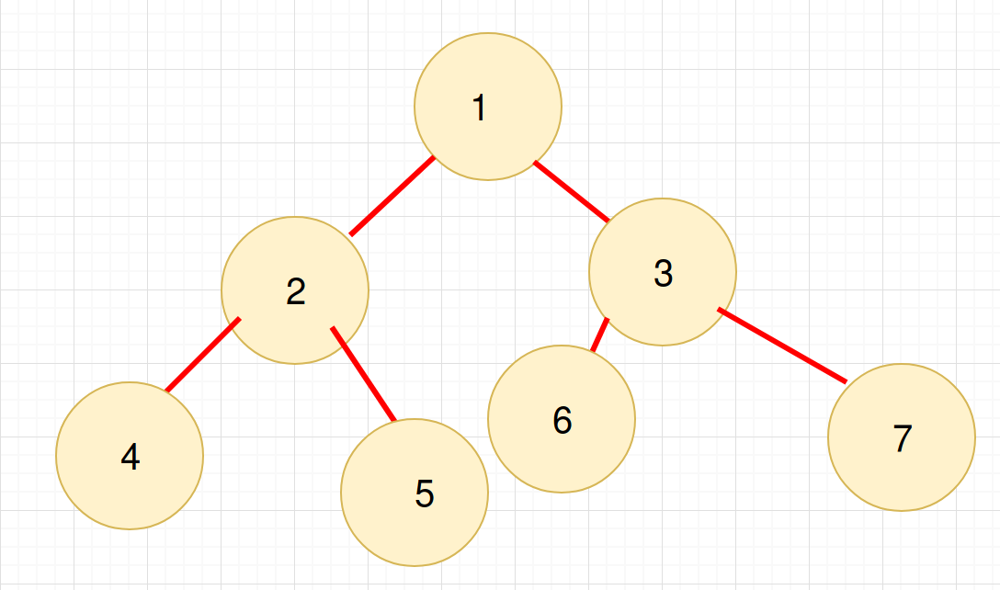

# Ağaclar(trees)

## 8.1 Ağac nədir?

Ağac da əlaqəli listlər kimi bir data strukturudur. Bildiyimiz kimi, əlaqəli listlərdə hər node özündən sonrakı node-a yönəlir(işarə edir).
Yəni əlaqəli list xətti data strukturudur, düz xətt boyunca hər node digərinə işarə edir.
Ağaclar isə qeyri-xəttidir və hər node bir neçə node-a işarə edə bilər.
Ağac strukturu əslində iyerarxik bir düzülüşün qrafik olaraq göstərilməsidir.
Ağacların ADT(Abstract Data Type)-də, elementlərin sırası(daxil edilmə ardıcıllığı) önəmli deyil. Əgər bu bizə önəmlidirsə, o zaman xətti data stukturlarından istifadə etməliyik.

## 8.2 Xüsusi məlumatlar

Ağaclarla bağlı bəzi məxsusi məlumatları burda sadalamaqda fayda var.
Qeyd edək ki, bəzi sözləri dilimizə bir-başa tərcümə edərkən, bəzən məna itirilir. 
Lakin, sözlərin əslini ingiliscə qeyd etməyə çalışıram. 
Məsələn, valideyn(parent) və övlad(child) sözləri burada sələf(predecessor) və xələf(successor) mənasında işlənilir.


* Ağaclarda *root* elə bir node-a deyilir ki, onun valideyni(parents) olmasın. Daha başqa cür desək, ondan əvvəl node olmasın.
Bir Ağac stukturunda yalnız bir root ola bilər(elə həqiqi həyatda da, ağacın bir kökü olur).
Bizim nümunəmizdə `(2)` root node-dur.
* Valideyndən övlada gedən əlaqəyə *edge* deyilir(a link from parent to child).
* Xələfi(övladı, uşağı) olmayan node leaf(yarpaq) adlanır(leaf node). Bizim nümunəmizdə, `(2)`, `(5)`, `(11)` və `(4)` leaf node-lardır.
* Eyni valideyn node-un övladları, qardaş(siblings) node-lar adlanırlar(təbii olaraq). Bizim halda, `(7)` və `(5)` `(2)`-yə nəzərən, `(5)` və `11` `(6)`-ya nəzərən sibling node-durlar. 
* Verilmiş dərinlikdə olan bütün node-lar eyni səviyyədə(level) hesab olunurlar. Məsələn, `(7)` və `(5)` eyni səviyyədə - level 1-dədirlər. root node-un səviyyəsi 0-dır.
* Node-un dərinliyi(depth) root node-dan ona qədər olan məsafə ilə ölçülür. Məsələn, node `(9)`-un dərinliyi 2-dir(`2 - 5 - 9`).
* Node-un hündürlüyü, həmin node-dan ən dərin node-a qədər olan məsafəsinə bərabərdir. Məsələn, `(7)`-nin hündürlüyü 2-dir(`7 - 6 - 11`).
* Ağacın hündürlüyü isə, root node-dan sonuncu ən altdakı node-a qədər məsafəyə bərabərdir. Məsələn, bizim nümunə ağacın hündürlüyü 3-dür.
* Node-un ölçüsü(size), özü də daxil olmaqla ardıcıllarının sayına bərabərdir. Məsələn, `(7)`-nin ölçüsü 3-dür(`7 - 6 - 11`).
* Əgər ağacın hər bir node-unun yalnız bir övladı(uşağı, xələfi) varsa, belə ağaca meyilli, əyri ağac(skew tree) deyilir.
Əgər hər node-un yalnız sol xələfi varsa buna sola meyilli ağac(left skew tree), yalnız sağ xələfi varsa, sağa meyilli ağac(right skew tree) deyilir.
Aşağıdakı şəkilə diqqət edək:

 

## 8.3 İkili ağaclar(binary tree)

Ağac nə zaman ikili ağac adlandırıla bilər?
Əgər hər node-un 0 və ya 1 və ya 2 ardıcılı(child) varsa bu zaman həmin ağaca ikili ağac deyə bilərik.

## 8.4 İkili ağac növləri

**Dəqiq ikili ağac(strict binary tree)**

Əgər hər bir node-un yalniz 2 ardıcılı və ya 0 ardıcılı varsa, bu zaman belə ağaca dəqiq iki ağac deyilir.


**Dolu ikili ağac(full binary tree)**

Əgər hər bir node-un yalnız və yalnız 2 ardıcılı(child) varsa və hər bir node eyni səviyyədədirsə(level), belə ağaca dolu ikili ağac deyilir.


**Tam ikili ağac(complete binary tree)**

Bu elə bir ikili ağac növüdür ki, orada bütün səviyyələr tam doludur, yalnız sonuncudan başqa, hansı ki, bütün məlumatlar solda yerləşir.


## 8.5 İkili ağacların xüsusiyyətləri

Aşağıdakı xüsusiyyətlər üçün, ağacın hündürlüyünü `h` kimi götürək.
Həmçinin, `root` node-un hündürlüyünü `0` qəbul edək.

Bu zaman hündürlüyü 0(`h=0`) olan ağacın h level-ində(səviyyəsində) node sayı `2^0(2 üstü 0) = 1`, hündürlüyü 1(`h=1`) olan ağacın h level-ində isə `2^1=2` qədər node var.

Yuxarıdakılara əsasən:

* Dolu ikili ağac üçün node-ların sayı `n`, -ə bərabərdir.
Dolu(full) ikili ağacda `h` level olduğunu bilirik. Bu səbəbdən biz, hər səviyyədə olan node sayını toplamalıyıq:


* Tam iki ağacda isə node-ların sayı `n`, minimum -a, maksimum -ə bərabərdir.
* Dolu ikili ağacda, leaf node-larin sayı -dır.
* Tam ikili ağacda, n node üçün, NULL link-lərin(wasted pointers) sayı `n+1`-dir.

**İkili ağacların strukturu**

İndi isə ikili ağacın strukturunu təyin edək.
Node-u(data-nı özündə saxlayan) ifadə etməyin bir üsulu budur ki, data ilə bərabər onun sağ və sol ardıcıllarına işarə edən linkləri saxlamaqdır.


```python
class BinaryTreeNode:
    def __init__(self, data):
        # root node
        self.data = data
        # Sol övlad(left child)
        self.left = None
        # Sağ övlad(right child)
        self.right = None
    
    def set_data(self, data):
        self.data = data
    
    def get_data(self):
        return self.data

    def get_left_child(self):
        return self.left
    
    def get_right_child(self):
        return self.right

```

**İkili ağaclar üzərində əməliyyatlar**

*Əsas əməliyyatlar*

* Ağaca element daxil etmək.
* Ağacdan element silmək.
* Ağacda element axtarmaq.
* Ağacı əvvəldən axıra qət etmək.

*Əlavə əməliyyatlar*

* Ağacın ölçüsünü(size) tapmaq.
* Ağacın hündürlüyünü tapmaq.
* Cəmin ən çox olduğu səviyyəni(level-i) tapmaq.
* Least common ancestor(ən az ümumi sələf) LCA-nın tapılması və s.

## 8.6 İkili ağacı qət etmək haqqında(tree traversal)

Ağacları emal etmək üçün, onları qət etməyin mexanimzini bilməliyik və bu bölmədə bu haqda danışacağıq.
Ağacın hər bir node-unu ziyarət etmək, ağacı qət etmək adlanır(tree traversal). 
Hər node yalnız bir dəfə emal olunur, lakin bir neçə dəfə ziyarət oluna bilər. 
Xətti data strukturlarında(əlaqəli listlər, yığın, növbələr) elementlər, ardıcıl olaraq ziyarət olunur. Lakin ağaclarda bunu bir neçə üsulu var.
Ağacı(data stukturu olan ağac) qət etmək, ağacda nəyisə axtarmağa bənzəyir, bir fərqlə ki, qət edərkən, müəyyən bir ardıcıllığa dayanırıq.
Digər tərəfdən, ağacı qət etmək onun bütün node-larını ziyarət etmək deməkdirsə, ağacda axtarış lazım node tapılanda dayanır.

**Ağacı qət etməyin mümkün növləri**

İkili ağacın root node-undan başlayaraq, 3 əsas addım var ki, onların icra olunma ardıcıllığı qət etməyin növünü müəyyənləşdirir.
Bu addımlar aşağıdakılardır:
* Hal-hazırkı node-da əməliyyat aparmaq(bu elə node-u ziyarət etmək deməkdir və `D` hərfi ilə işarələnir).
* Sol ardıcıl node-u qət etmək(`L` hərfi ilə işarələnir).
* Sağ ardıcıl node-u qət etmək(`R` hərfi ilə işarələnir).
Yuxarıdakı anlayışlara əsasən, bizim 6 mümkün variantımız olacaq:

1. LDR: Sol altağacı(subtree) emal et, hazırkı node-u emal et və daha sonra sağ altağacı emal et.
2. LRD: Sol altağacı emal et, sağ altağacı emal et və hazırkı node-u emal et.
3. DLR: Hazırkı node-u emal et, sol altağacı emal et və daha sonra sağ altağacı emal et.
4. DRL: Hazırkı node-u emal et, sağ altağacı emal et və sol altağacı emal et.
5. RDL: Sağ altağacı emal et, hazırkı node-u emal et və sol altağacı emal et.
6. RLD: Sağ altağacı emal et, sol altağacı emal et və hazırkı node-u emal et.

**Qət etməni təsnifləşdirmək**

Node-ların hansı ardıcıllıqla emal olunması, qət etmənin də növünü müəyyən edir.
Təsnifləşdirmə, hal-hazırkı node-un hansı ardıcıllıqla emal olunması əsasında baş verir.
Bu o deməkdir ki, əgər biz hal-hazırkı node(`D`)-a əsasən təsnifat aparırırqsa və bu node ortada gəlirsə, bu zaman bizim üçün elə də fərq etmir ki, `L` `D`-dən solda ya `R` `D`-dən sağda yerləşir.
Eynilə bizim üçün `L`-in `D`-dən sağda, `R`-in `D`-dən solda olmasının da əhəmiyyəti yoxdur.
Bu səbəbdən, biz yuxarıdakı 6 mümkün variantı 3-ə endirə bilərik:
> Qeyd: Aşağıdakıları öz dilimizdə və rus dilində verirəm ki, daha aydın olsun. Bəzilərini isə tərcümə edə bilmədim.
* Preorder (DLR) Traversal - предварительный обход - ilkin, ön qət etmə.
* İnorder (LDR) Traversal - ...
* Postorder (LRD) Traversal - постобработка  - ...

Geri qalan müzakirəmiz üçün aşağıdakı diaqramı əsas götürək:

